# 실습 02 — 연구실 기본 실험 장비 5종 (2026-09-15)

> 상태: 초안 (음성메모 전사본 + 현장 사진) / 캡처 자리 12개 중 완료 6 (#1·2·3·9·10·12) / 부분 4 (#4·5·6·7) / 남음 2 (#8·11)
> 보고서 제출: 조별 1부, 한글 파일, 20페이지 이내, **원리 위주** — 마감 **2026-10-01**

## 1. 실습 목적

연구실에서 가장 기본이 되는 장비 5종의 사용법과 원리를 익힌다.

1. 마이크로피펫
2. 전자저울
3. pH 미터
4. 핫플레이트 교반기
5. 진공 챔버

- 다섯 장비는 따로 떨어진 도구가 아니다. 다음 회차의 PDMS 구조물 제작 흐름과 순서대로 이어진다.
  - **계량** (피펫·저울) → **조건 맞추기** (pH 미터) → **혼합·경화** (핫플레이트 교반기) → **기포 제거** (진공 챔버)
  - 이 흐름은 보고서 구성 제안이며, 교수님이 직접 이렇게 묶어 설명한 것은 아니다.

이번 회차는 좁은 공간에 다 같이 모이지 않고, 한 명씩 장비를 맡아 직접 조작하면서 사진을 찍고 설명을 듣는 방식으로 진행했다.

## 2. 공통 주의사항 — 안전과 오염 방지

- `[수업]` 실습에서 가장 중요한 두 가지는 **안전**과 **외부 오염 방지**다.
- `[수업]` 장갑을 제대로 끼고, 70% 에탄올을 장갑에 뿌려 먼지를 없앤다. 작업대도 에탄올과 티슈로 닦아 깨끗한 상태에서 시작한다.
- `[수업]` 실험은 여러 번 반복해야 한다. 매번 같은 조건에서 시작해야 회차 사이의 **오차가 줄어든다**.
- `[수업]` 100% 대신 70% 에탄올을 쓰는 이유: 100%는 피부에 좋지 않고, 70%로도 소독에 충분하다.
- `[보충]` 70%가 오히려 **더 효과적**인 이유: 소독은 에탄올이 미생물의 단백질을 변성시켜서 일어나는데, 이 반응에는 물이 필요하다. 또 100% 에탄올은 너무 빨리 증발해서 세포 안까지 스며들 시간이 부족하다. (출처: University of Iowa EHS)

| 장갑 착용 | 70% 에탄올 준비 | 장갑에 에탄올 분사 |
|---|---|---|
| 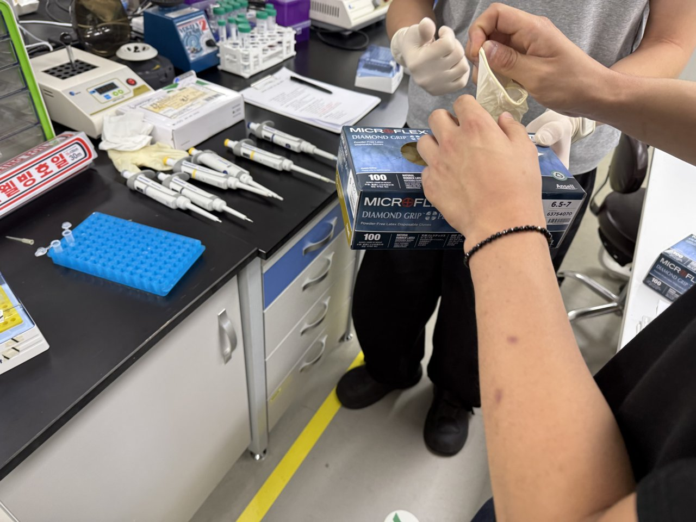 | 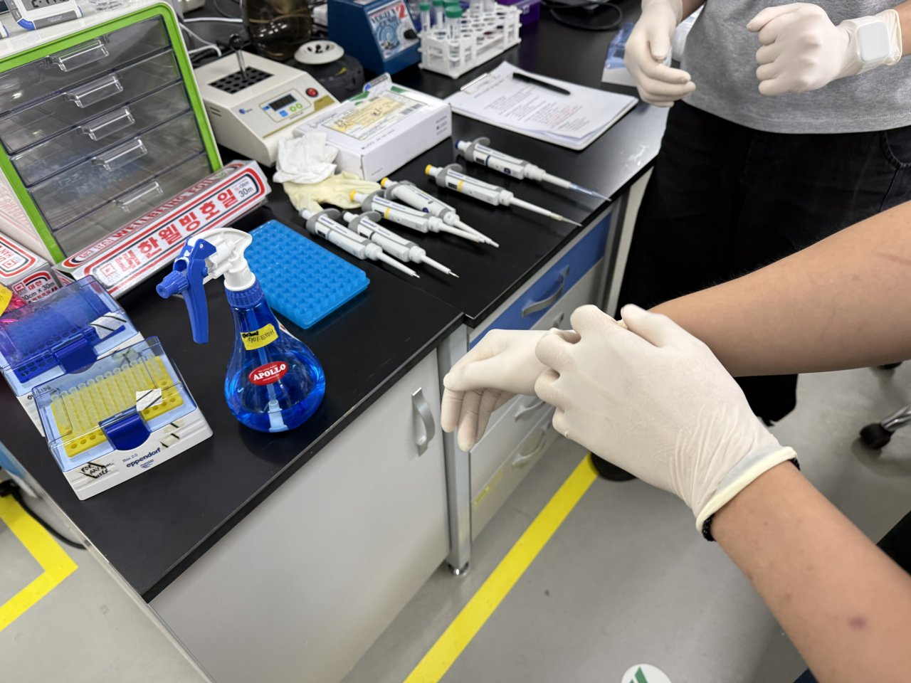 | 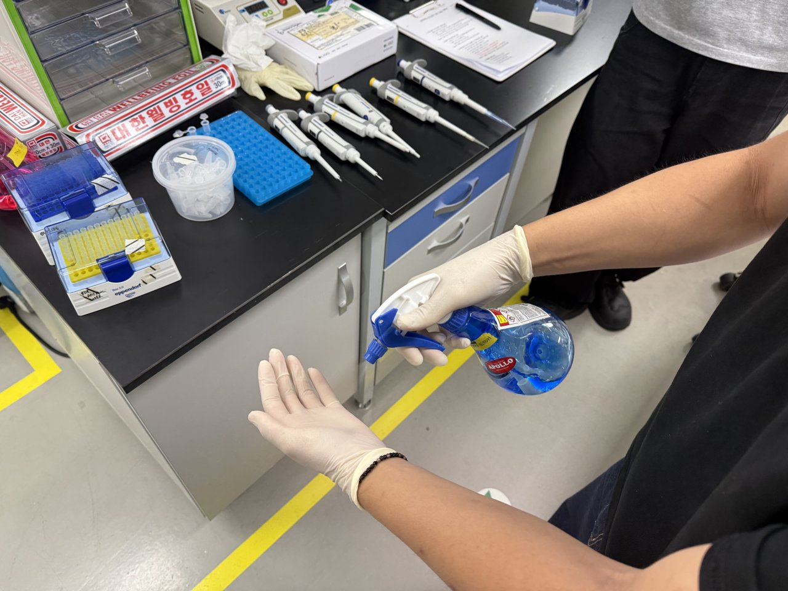 |

- 사진 확인: 분무병 라벨 `70% EtOH`, 라텍스 장갑 사용

## 3. 장비 한눈에 보기

| 장비 | 용도 | 핵심 원리 |
|---|---|---|
| 마이크로피펫 | µL 단위 액체를 정확히 옮김 | 피스톤과 스프링으로 공기를 밀어내 정해진 부피만큼 음압을 만듦 |
| 전자저울 | 시료 질량 측정 (최소 0.1 mg) | 전자기력으로 접시를 원위치로 되밀고, 그때 흐르는 전류로 질량 계산. 영점·수평·바람막이로 외부 영향 제거 |
| pH 미터 | 용액의 pH를 수치로 측정 | 유리전극이 H⁺ 농도에 따라 전압을 만듦(pH 1당 약 59 mV). 완충용액으로 영점·기울기를 보정한 뒤 측정 |
| 핫플레이트 교반기 | 섞기 + 가열 | 아래쪽 회전 자석이 용액 속 마그네틱 바를 돌림. 온도로 열경화 |
| 진공 챔버 | 기포 제거(탈포) | 감압 → 기포 팽창(보일) → 부력으로 부상 → 표면에서 파열 |

## 4. 장비별 사용법과 원리

### 4-1. 마이크로피펫 (Eppendorf)

**구성과 용량**
- `[수업]` 몸체의 창에 설정 용량이 표시된다. 피펫마다 쓸 수 있는 범위가 다르다.
  - 파란 피펫: 100–1000 µL → 파란 팁
  - 노란 피펫: 10–100 µL → 노란 팁
- `[수업]` 팁 색이 피펫 색과 같아서 맞는 팁을 구별할 수 있다.
- `[수업]` 1000 µL = 1 mL.

| 피펫·팁 박스 배치 | 피펫 고르기 | 용량 창 (10–100 µL, 050 설정) |
|---|---|---|
| 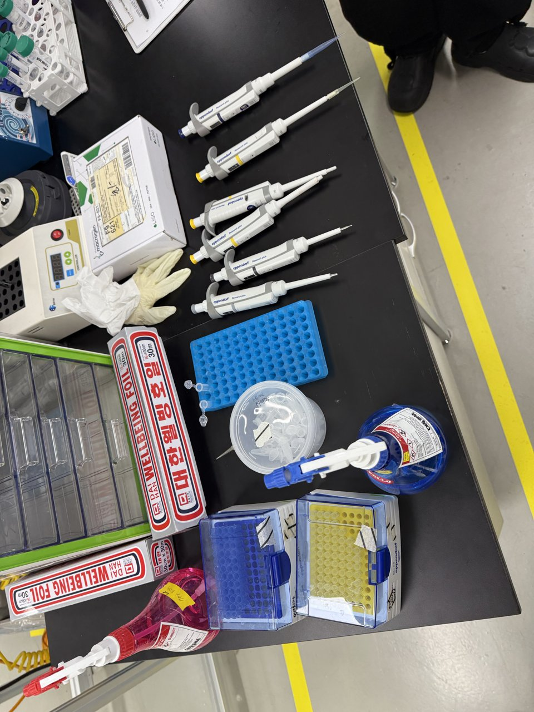 | 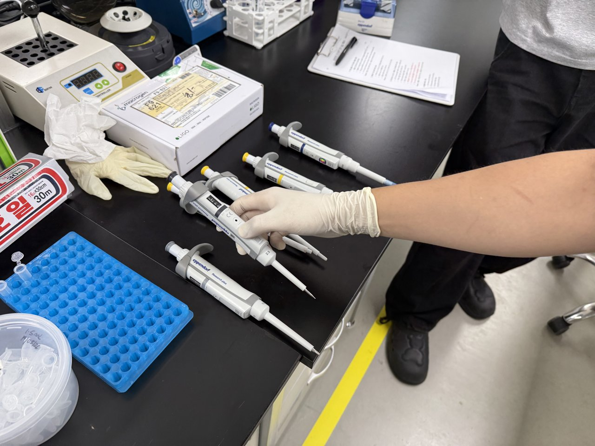 | 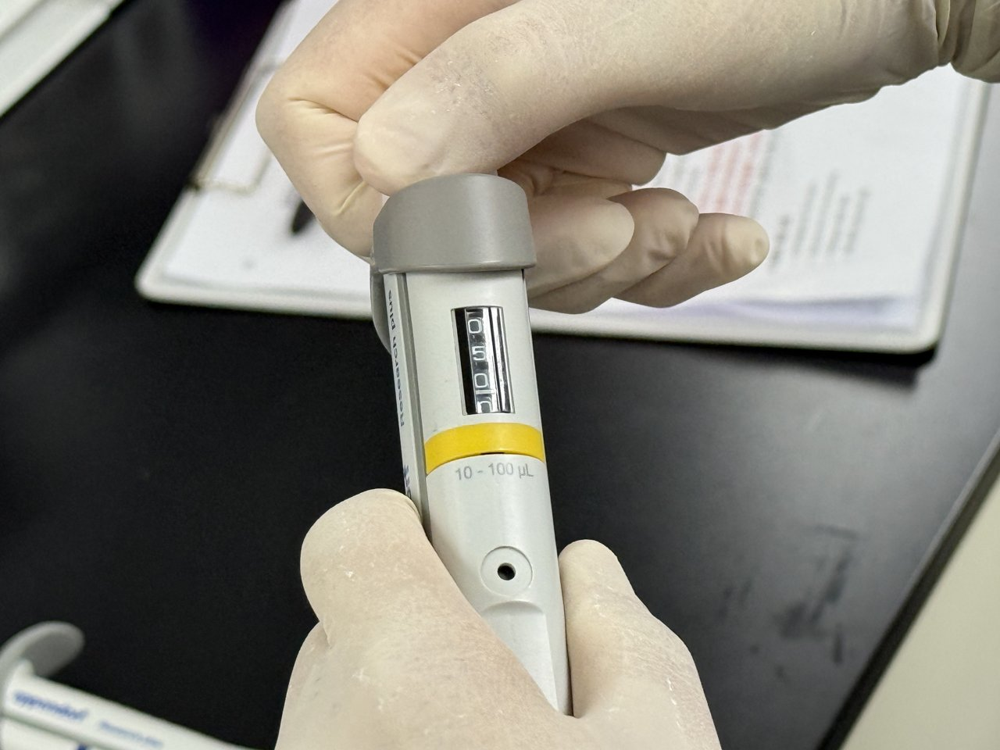 |

- 사진 확인: 모델은 Eppendorf **Research plus**. 버튼 색이 파랑·노랑·회색으로 다르고, 팁 박스도 파랑(1000 µL용)·노랑(100 µL용)으로 나뉘어 있다.
- `[보충]` Research plus는 용량 범위별로 버튼 색이 정해져 있다. 수업에서 말한 "10–200 사이 여러 개"는 노란 계열의 10–100 µL와 20–200 µL를 말한 것으로 보인다. (출처: Eppendorf 매뉴얼) ❓확인: 회색 피펫 두 개의 범위 — 사진에 "2.5", "10" 표시가 보인다.
- 창에 `050`이 보이면 **50 µL**로 설정된 것이다. 이번 실습 값과 같다.

**사용 순서** `[수업]`
1. 원하는 용량으로 맞춘다 (위쪽 다이얼을 돌림).
2. 팁을 꾹 눌러 끼우고 다시 한 번 확인한다.
3. 버튼을 **첫 번째 멈춤(딸깍)** 까지 누른다. 끝까지 세게 누르지 않는다.
4. 그 상태로 팁을 용액에 넣고, 버튼을 **천천히** 놓아 빨아들인다.
5. 옮길 용기에 넣고 버튼을 눌러 내보낸다.
6. 팁 제거 버튼을 눌러 팁을 쓰레기통에 버린다.
7. **다 쓰면 용량을 원래(기본) 값, 즉 그 피펫의 최대 용량으로 되돌린다.** (예: 10–100 µL 피펫은 100, 20–200 µL 피펫은 200)

- `[보충]` 3·5단계: 제조사 매뉴얼 기준으로 버튼에는 멈춤이 두 번 있다. 흡입할 때는 첫 번째 멈춤까지만 누르고, 배출할 때는 두 번째 멈춤(blow-out)까지 눌러 남은 액체를 밀어낸다. (출처: Eppendorf Research plus 매뉴얼) ❓확인: 수업에서 배출할 때 두 번째 멈춤까지 눌렀는지 영상으로 확인

| 팁 끼우기 | 준비 (튜브 + 100 µL 피펫) | 튜브에 옮기기 | 1.5 mL 튜브에 배출 |
|---|---|---|---|
| 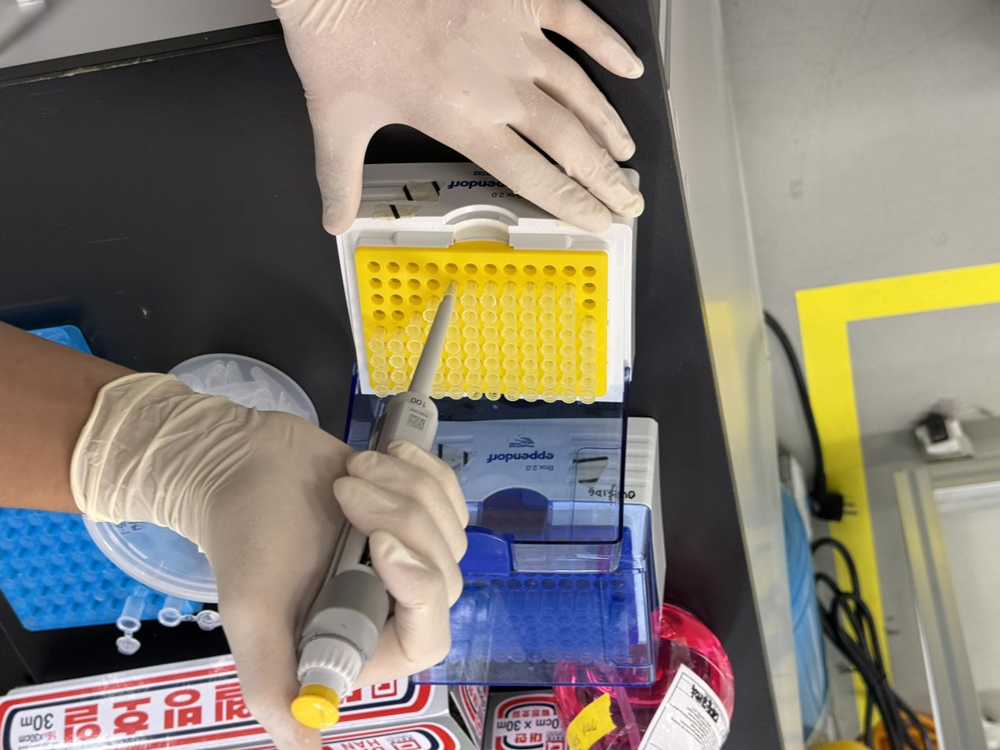 | 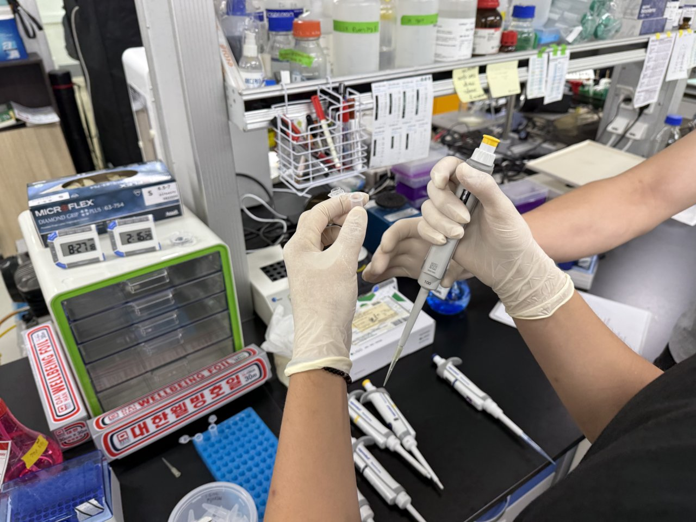 | 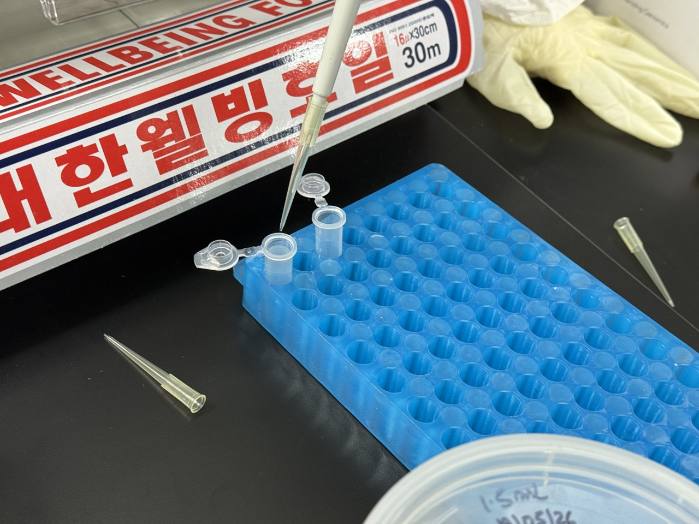 | 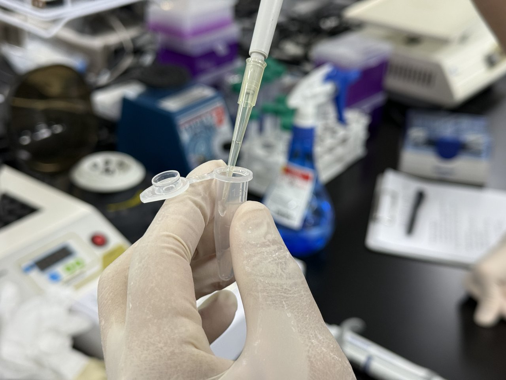 |

📷 캡처 필요 #4 — (부분) 팁을 용액에 넣고 **흡입**하는 순간. 영상에서 캡처

**원리와 주의점**
- `[수업]` 천천히 놓아야 한다. 액체의 점도에 따라, 빨리 놓으면 액체가 확 튀어 올라 피펫 안쪽이 오염될 수 있다.
- `[수업]` 원하는 부피를 범위로 포함하는 피펫이 여러 개면, **범위가 좁은 쪽**을 고른다. 예를 들어 50 µL는 20–200 µL보다 10–100 µL 피펫에서 오차가 작다.
- `[수업]` 다 쓰고 기본값(**최대 용량**)으로 되돌리는 이유: 피펫 안에는 스프링이 있다. 다른 값으로 돌려둔 채 오래 두면 스프링이 그 상태로 변형돼 정확도가 떨어질 수 있다. 수업에서는 "10–100 피펫은 100, 20–200 피펫은 200이 기본값"이라고 설명했다.
- `[보충]` 스프링이 변형되는 구조:
  - 다이얼로 용량을 **낮추면** 내부 스크루(스핀들)가 앞으로 나오면서 피스톤의 윗 멈춤 위치가 내려간다. 그만큼 스프링이 **더 압축된 채로** 있게 된다.
  - **최대 용량**에서는 스크루가 뒤로 가장 많이 빠져 있어 스프링 압축이 **가장 작은** 상태다.
  - 그래서 최대 용량으로 두면 스프링이 오래 눌린 채 피로가 쌓이는 것을 줄일 수 있다.
  - 다만 조립 상태에서도 스프링에는 기본 압축(예압)이 걸려 있으므로, "완전히 힘이 없는 상태"가 아니라 "압축이 가장 적은 상태"라고 쓰는 것이 정확하다.
- `[보충]` "보관할 때 최대 용량으로 둔다"는 여러 제조사·판매사 가이드에 나오는 관행이다. 다만 실제 정확도에 미치는 영향이 얼마나 되는지는 연구자들 사이에 의견이 갈린다. 보고서에는 수업 설명을 주로 쓰고, 이견이 있다는 점은 고찰에 한 줄 정도 적는 편이 안전하다. (출처: Microlit, Camlab 보관 가이드, ResearchGate 토론)

**원리 심화** `[보충]`
- **공기 치환(air displacement) 방식:** 버튼을 누르면 피스톤이 내려가 실린더 안의 공기를 밀어낸다. 버튼을 놓으면 피스톤이 올라가면서 공기층(air cushion)이 늘어나고, 그만큼 압력이 낮아져 액체가 팁 안으로 들어온다. 액체가 피스톤에 직접 닿지 않고 **공기층을 사이에 둔다**는 점이 핵심이다. 그래서 팁만 갈아 끼우면 시료끼리 섞이지 않는다.
- **팁이 일회용인 이유:** 액체가 닿는 곳이 팁뿐이다. 팁을 바꾸는 것만으로 교차 오염을 막을 수 있어서, 2장의 오염 방지 원칙과 이어진다.
- **정확도를 떨어뜨리는 요인:** 공기층은 온도, 액체의 점도·증기압에 따라 늘었다 줄었다 한다. 그래서 다음을 지키면 오차가 줄어든다.
  - 피펫을 수직으로 잡는다.
  - 팁을 액면 아래 몇 mm만 담근다.
  - 흡입한 뒤 잠깐 기다렸다가 꺼낸다.
  - 같은 액체를 한두 번 빨았다 뱉어 팁 안쪽을 적셔둔다(pre-wetting).
- **점도가 높은 액체(PDMS 같은 것):** 공기 치환 방식으로는 정확히 옮기기 어렵다. 이럴 때는 피스톤이 액체에 직접 닿는 **양변위(positive displacement)** 피펫을 쓰기도 한다. PDMS 같은 점성 시료는 부피 대신 **저울로 무게를 달아** 비율을 맞추는 경우가 많다. ❓확인: 이번 수업에서 실제로 PDMS를 저울로 계량했는지 (저울 옆에 PDMS 원료 병이 있는 것만 사진으로 확인됨)
- (출처: Eppendorf Userguide No.19 *Fundamentals of dispensing*, Gilson Learning Hub)

### 4-2. 전자저울

**사용 순서** `[수업]`
1. 전원을 켜고 **수평**을 확인한다. 수평계의 기포가 원 안에 들어와야 한다.
2. 영점을 맞춘다.
3. 한쪽 문만 열고 **웨잉 디쉬(plastic weighing dish)** 를 올린 뒤 문을 닫는다.
4. 다시 영점을 맞춘다(tare). 이렇게 하면 디쉬 무게가 빠진다.
5. 시료를 올리고 값을 읽는다.

- `[수업]` 가루나 액체는 디쉬 없이 잴 수 없어서 디쉬가 꼭 필요하다.
- `[수업]` 실험에서 다루는 시료가 소량이라서 소수점 아래 자릿수가 많이 나오는 저울이 필요하다. (수업에서는 앞 시간에 배운 나노·마이크로 크기 이야기와 함께 설명함. 다만 저울이 재는 것은 **질량(mg 단위)** 이지 입자 크기가 아니다)
- `[보충]` 문(바람막이, draft shield)을 닫는 이유: 공기 흐름이 저울판을 눌러 값이 흔들리는 것을 막기 위해서다.
- 사진 확인: **Sartorius 분석용 저울**. 화면에 `Max 220 g`, `d = 0.1 mg`이 표시된다. 한 번에 최대 220 g까지 잴 수 있고, 읽을 수 있는 최소 단위(readability, `d`)가 **0.1 mg**이라는 뜻이다.
  - "몇째 자리 저울"이라는 표현은 **표시 단위에 따라 달라진다**. 표시 단위가 **g이면 0.0001 g(소수점 넷째 자리)**, **mg이면 0.1 mg(소수점 첫째 자리)** 이다. 둘은 같은 양이다.
  - 실험실에서 말로 "소수점 넷째 자리 저울"이라고 하는 것은 g 기준 표현이다. 보고서에는 **"최소 표시 단위 0.1 mg (= 0.0001 g)"** 처럼 단위를 함께 쓴다.
- 사진 확인: 화면 아래에 `0`(영점)과 `T`(tare) 버튼이 있고, 표시창 오른쪽에 수평계가 있다. 유리 바람막이는 옆문을 여닫는 구조다.
- 사진 확인: 저울 옆 갈색 병의 라벨은 **Silicone Elastomer** — 4-4·4-5에서 다루는 PDMS의 본체 원료다.

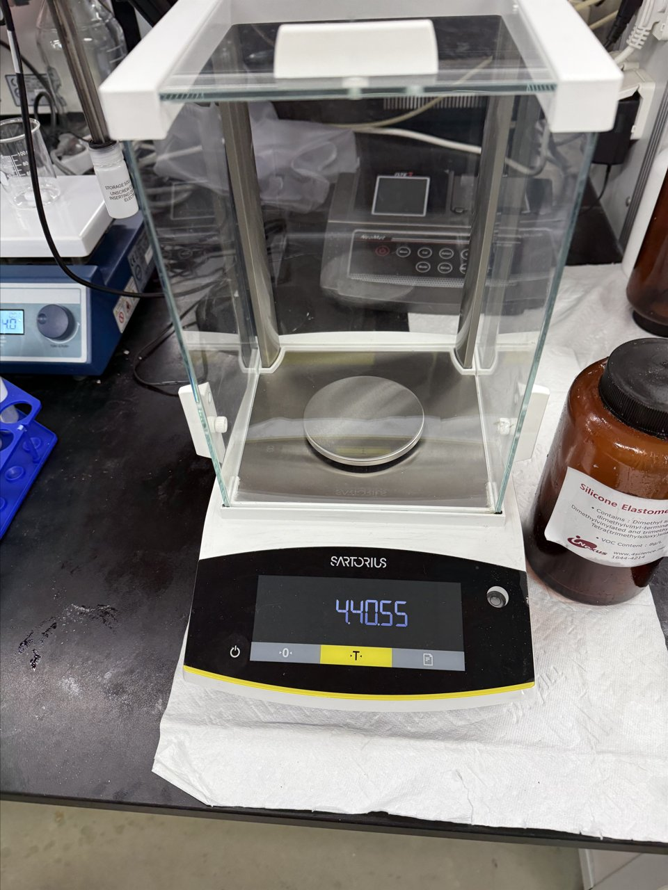

📷 캡처 필요 #5 — (부분) 수평계 기포 클로즈업. 위 사진에서는 작게만 보인다

**원리 심화** `[보충]`
- **전자기력 복원(EMFC) 방식:** 분석용 저울은 보통 이 방식을 쓴다.
  1. 접시에 물건을 올리면 접시가 아주 조금 내려간다.
  2. 센서가 이 위치 변화를 감지한다.
  3. 코일에 전류를 흘려 전자기력으로 접시를 **원래 위치까지 다시 밀어 올린다**.
  4. 이때 필요한 전류는 물건의 무게에 비례한다. 이 전류값을 질량으로 바꿔 화면에 보여준다.
- **내부 보정(`CALRUN`):** 저울 안에 무게를 이미 알고 있는 추가 들어 있다. 저울이 스스로 이 추를 올려서 측정값을 맞춘다. 실내 온도가 바뀌거나 저울을 옮긴 뒤에 필요하다. 피펫·pH 미터와 같은 **"기준 맞추기"** 원리다.
- **0.1 mg 단위에서 값을 흔드는 요인:** 공기 흐름(그래서 문을 닫는다), 진동, 시료와 저울의 온도 차이, 정전기, 기울기(그래서 수평을 맞춘다).
- (출처: Hinotek *EMFC principle*, CASRAI *Analytical balance calibration guide*)

| 저울·pH 미터 배치 (문을 여는 중) |
|---|
| 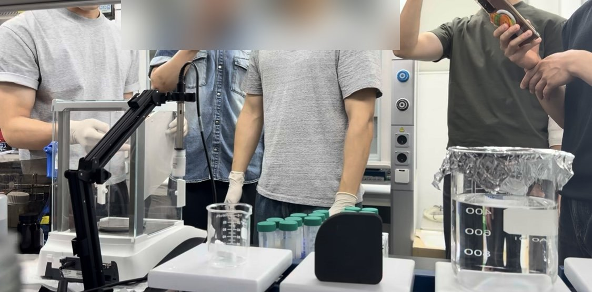 |

📷 캡처 필요 #6 — (부분) 디쉬를 올린 장면. `CALRUN`(내부 보정 중) 화면이 뜬 사진이 있지만 파일로 전달되지 않아서 다시 받아야 한다

### 4-3. pH 미터

- `[수업]` 리트머스 종이(pH 시험지): 색으로 대략적인 범위만 알려준다. 빠르고 쉽지만 **정확도가 낮다**.
- `[수업]` 연구에서는 정확한 수치가 필요해서 pH 미터를 쓴다.
- `[수업]` pH 7은 중성, 7보다 낮으면 산성, 높으면 염기성이다.

**사용 순서 (보정 → 측정)** `[수업]`
1. 전원을 켠다.
2. **pH 7 표준 완충용액**에 전극을 넣어 기준을 맞춘다. 가운데(중성)를 기준으로 삼는 것이 가장 좋다.
3. pH 4, pH 10 표준용액으로 확인한다. 예를 들어 pH 4 용액에서 **4.01**이 나와야 한다. 값이 다르면 아직 기준이 안 잡힌 것이다.
4. 측정할 용액에 넣고 값을 읽는다.
5. 목표 pH보다 높으면 산을, 낮으면 염기를 조금씩 넣으면서 맞춘다. 목표값은 보통 참고 논문의 실험 조건을 따른다.

- `[보충]` 이 과정을 **보정(calibration)** 이라고 한다.
  - 전극의 전압-pH 관계(**기울기와 오프셋**)는 시간에 따라 조금씩 변한다. 그래서 정확히 재려면 값을 알고 있는 **표준 완충용액(buffer solution) 2~3개**로 기준을 맞춰야 한다.
  - 보통 중성인 **pH 7.00**으로 영점(이론상 0 mV)을 먼저 잡는다.
  - 그다음 산성 쪽 **pH 4.01**과 염기성 쪽 **pH 10.01**(제조사에 따라 10.00)을 차례로 측정한다. 이렇게 전극의 **기울기(slope, pH 1당 전압 변화량)** 를 맞춘다.
  - 측정할 시료의 pH가 두 완충용액 사이에 들어오도록 고르는 것이 원칙이다.

| 전극 스탠드 + 측정용 비커 | pH 4.01 완충용액 (선반에 pH 7.00) |
|---|---|
| 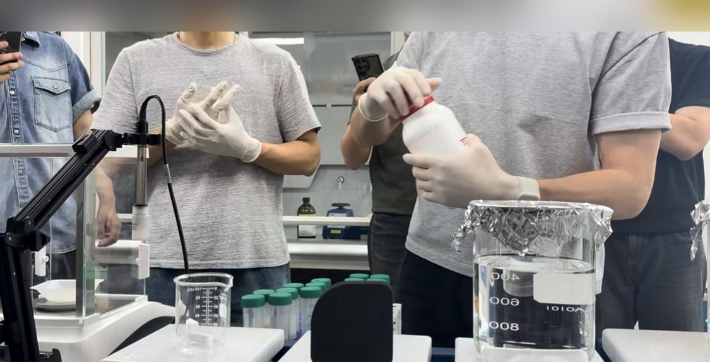 | 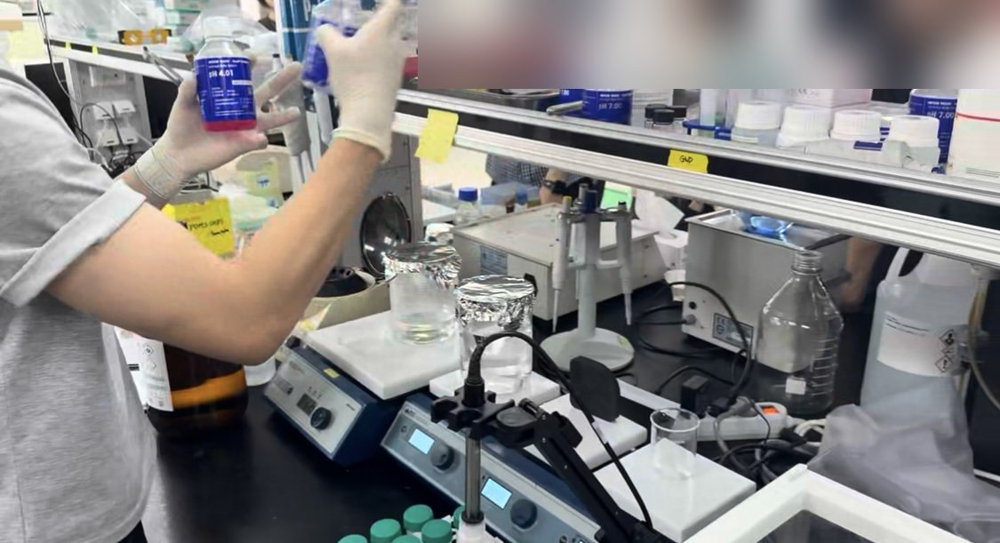 |

- 사진 확인: 표준 완충용액 병 라벨에 **pH 4.01**과 **pH 7.00**이 보인다. 수업에서 말한 "4.01"과 일치한다.
- 사진 확인: 전극은 스탠드 팔에 고정돼 있고, 쓰지 않을 때는 끝에 **보관액 병(storage solution)** 을 끼워둔다. 병에 "UNSCREW CAP BEFORE INSERTING OR REMOVING ELECTRODE"라고 적혀 있다.
- 사진 확인: 뒤쪽 pH 미터 본체에 `NeoMet` 표시가 보인다.
- ❓확인: pH 10 쪽 표준용액의 정확한 값 (보통 10.01 — 병 라벨은 사진에 없음)

**원리 심화** `[보충]`
- **유리전극:** 끝의 얇은 유리막이 용액 속 수소 이온(H⁺)에 반응해 전압을 만든다. 이 전압을 기준전극의 전압과 비교해서 pH를 계산한다.
- **네른스트 식:** 25 °C에서 pH가 1 바뀔 때마다 이론적으로 약 **59.16 mV**씩 전압이 바뀐다. 이 값을 **기울기(slope)** 라고 한다.
  - pH 7에서는 전압이 이론상 0 mV다. 위 보정 순서에서 **pH 7로 영점을 먼저 잡는 이유**가 이것이다. 수업의 "7을 기준으로" 설명도 여기서 나온다.
- **보정 결과 판단:** 기울기가 이론값의 대략 95–105% 안이면 전극 상태가 정상으로 본다. 이 범위를 벗어나면 전극이 낡았거나 오염됐을 가능성이 있다.
- **온도 영향:** 기울기 자체가 온도에 따라 바뀐다. 그래서 측정기는 온도 보정 기능을 함께 쓴다.
- **보관액에 담가두는 이유:** 유리막이 마르면 반응이 느려지고 값이 부정확해진다.
- **완충용액을 바꿀 때:** 용액끼리 섞이면 기준이 틀어진다. 그래서 바꿀 때마다 증류수로 전극을 헹구는 것이 일반적이다. ❓확인: 수업에서 헹굼 과정을 했는지
- (출처: Metrohm *How to calibrate a pH meter*, USGS *Field Measurements: pH*, Atlas Scientific *pH slope*)

📷 캡처 필요 #7 — (부분) pH 10 표준용액 라벨
📷 캡처 필요 #8 — (남음) 전극을 용액에 넣고 표시창에 값이 뜬 장면 → **다음 실습 때 촬영**

### 4-4. 핫플레이트 교반기 (Hot plate stirrer)

**원리** `[수업]`
- 판 아래에 자석이 들어 있다. 용액에 **마그네틱 바(stirring bar)** 를 넣으면 두 자석이 함께 돌아 용액이 섞인다(교반).
- 가열 기능이 있어 온도를 올리고 내릴 수 있다.
- 모드에 따라 RPM만, 온도만, 또는 둘 다 설정할 수 있다.

**사용 순서** `[수업]`
1. 용액과 마그네틱 바를 넣고 판 위에 올린다.
2. RPM을 설정한다. 보통 500 정도까지 올리며, 높을수록 빨리 돈다.
3. 필요하면 온도를 설정한다. 시연에서는 50 °C까지 올렸다.
4. 끝나면 RPM과 온도를 모두 내리고 끈다.

**용도** `[수업]`
- 용매와 용질 섞기: 액체-액체, 액체-고체, 폴리머 섞기
- **열경화성 물질 굳히기**: PDMS(폴리머, 실리콘 계열)는 열을 가하면 굳는다. 경화제와 섞어 몰드에 붓고 가열하면 굳고, 떼어내면 몰드 모양의 구조물이 나온다. PDMS는 다음 회차에서 자세히 배운다.

- ❓확인: 최대 온도 — 전사본에 "300 50도"로 적혀 있음. 장비 사진이나 모델명으로 확인한다.

| 표시창 (위치별 독립 제어) | 옆에서 본 모습 |
|---|---|
| 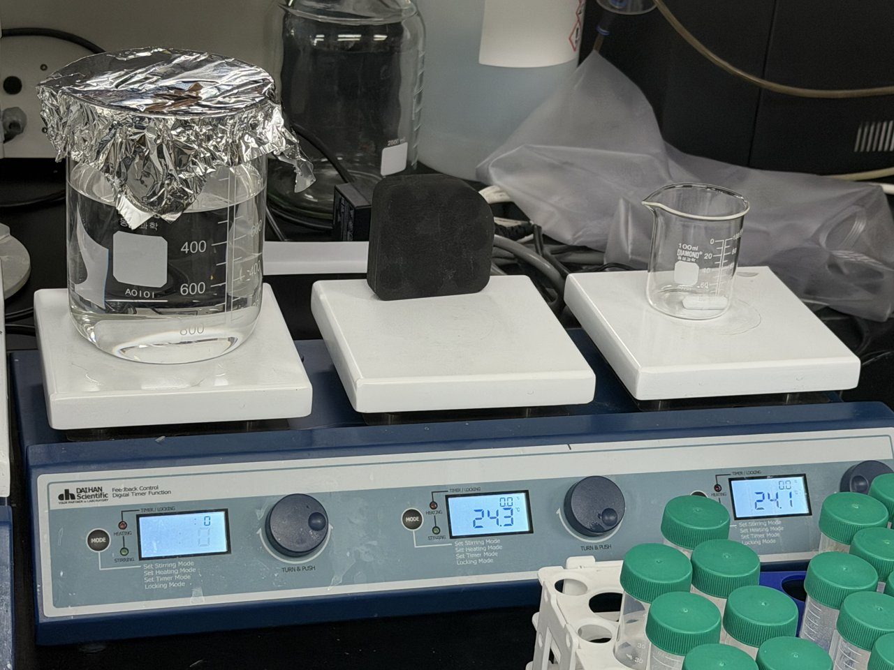 | 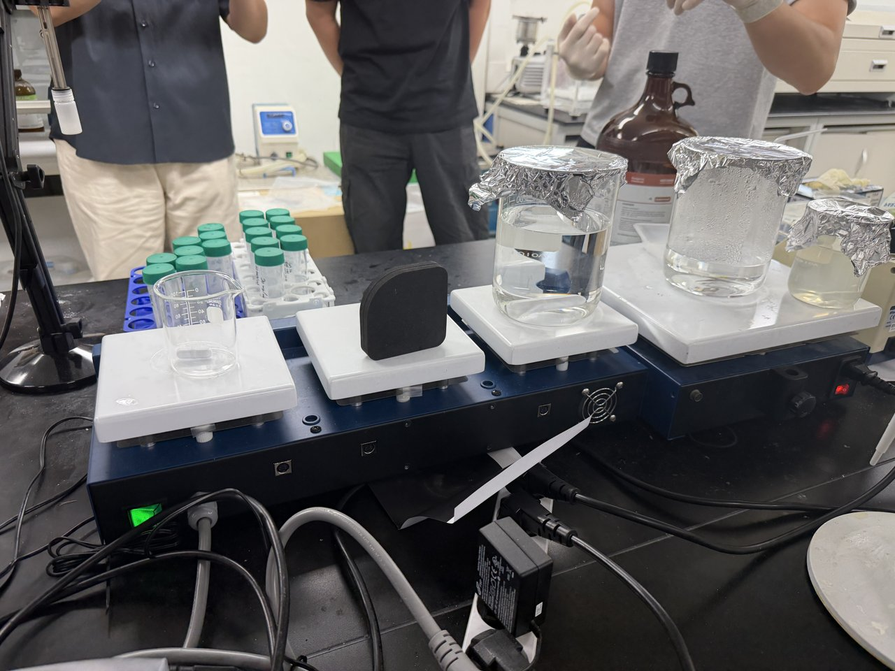 |

- 사진 확인: **DAIHAN Scientific** 제품으로, 판 여러 개가 한 몸체에 붙은 다구(multi-position) 핫플레이트 교반기다. 패널에 `Feedback Control`, `Digital Timer Function`이 적혀 있다.
- 사진 확인: 모드 버튼으로 `Set Stirring / Heating / Timer / Locking Mode`를 바꾸고, `TURN & PUSH` 다이얼로 값을 정한다. 표시창의 24.3 °C, 24.1 °C는 가열 전 실온이다.
- 사진 확인: 오른쪽 비커 바닥에 흰색 **마그네틱 바**가 보인다.

| 설정 버튼 조작 | 다이얼 조작 | **500 rpm** 교반 중 |
|---|---|---|
| 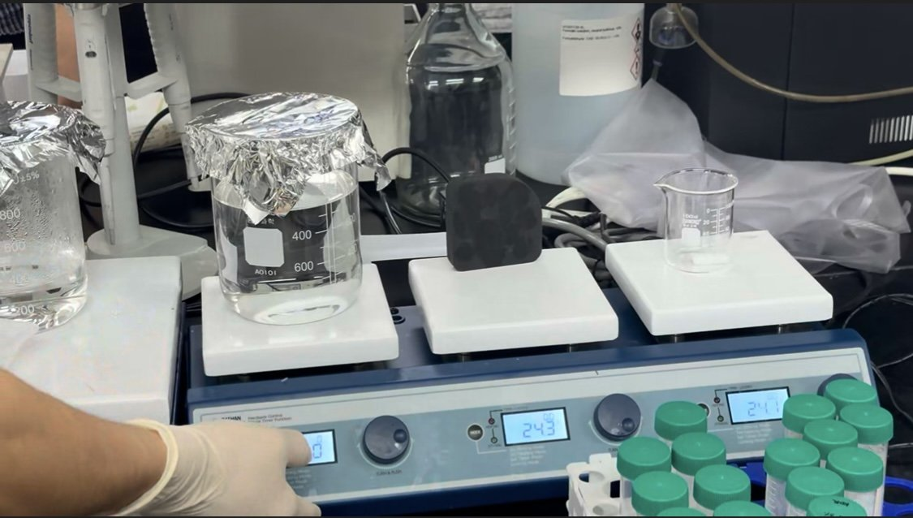 | 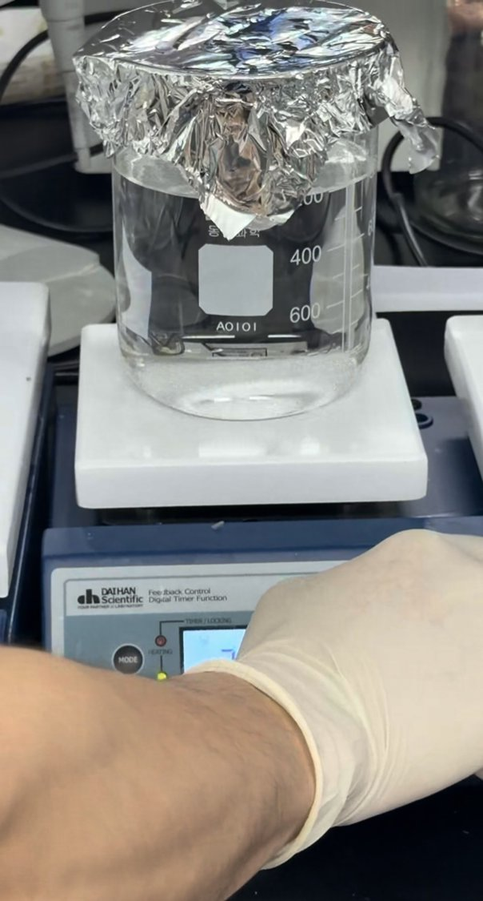 | 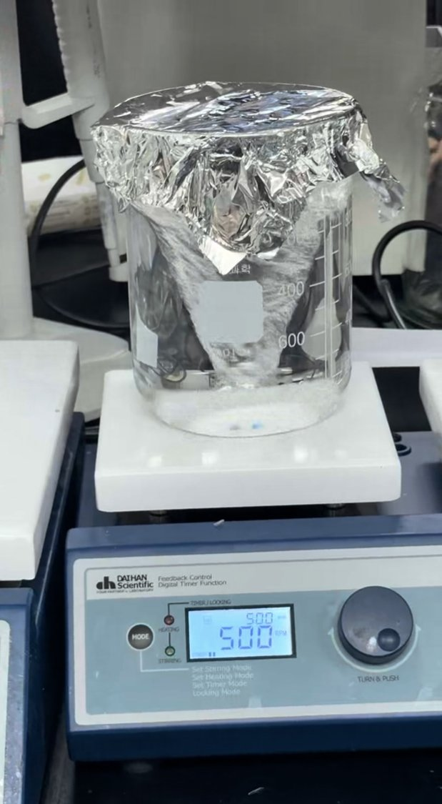 |

- 사진 확인: 표시창에 설정값 `500`과 현재값 `500 rpm`이 함께 뜬다. 수업에서 말한 "보통 500 정도"와 일치한다.

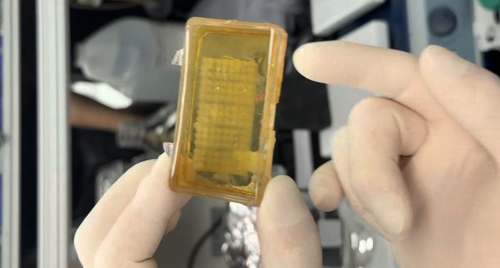

- 사진 확인: 작은 돌기가 격자 모양으로 배열된 구조물이다. 수업에서 말한 "뾰족뾰족한 몰드"로 열경화한 결과물이다. ❓확인: 이것이 몰드 자체인지, 몰드에서 떼어낸 PDMS인지 (노란빛이 몰드 재질 때문인지)

**원리 심화** `[보충]`
- **자석 커플링:** 판 아래 모터에 붙은 자석이 돌면, 용기 안 마그네틱 바가 자기력에 끌려 같이 돈다. 용기에 구멍을 내거나 막대를 넣지 않아도 되므로 뚜껑(호일)을 덮은 채 섞을 수 있고, 오염도 줄어든다.
- **RPM을 너무 높이면:** 바가 자석의 회전을 따라가지 못하고 튀는 **디커플링**이 생긴다. 그래서 RPM은 천천히 올린다. 점도가 높은 액체일수록 더 그렇다. ❓확인: 수업에서 이 주의점을 언급했는지
- **Feedback Control:** 설정 온도와 실제 온도를 계속 비교해서 히터 출력을 조절하는 방식이다. 이 장비는 패널에 이 문구가 적혀 있다.
- **PDMS 열경화 조건:** 제조사 데이터시트(Sylgard 184) 기준으로 본체와 경화제를 **10:1** 로 섞는다. 경화 시간은 온도에 따라 크게 달라진다.

  | 온도 | 경화 시간 |
  |---|---|
  | 실온 (25 °C) | 약 48시간 |
  | 100 °C | 약 35분 |
  | 125 °C | 약 20분 |
  | 150 °C | 약 10분 |

  온도를 올리면 가교 반응이 빨라져 **시간을 크게 줄일 수 있다**. 수업의 "100도라 뜨겁다"는 설명과 맞는다. 다만 이 실험실의 PDMS 원료(Inexus 병)가 Sylgard 184와 같은 조건인지는 ❓확인이 필요하다.
- (출처: Dow *SYLGARD 184 Technical Data Sheet*)

📷 캡처 필요 #9 — ✅ 500 rpm 교반 화면으로 대체 (바가 도는 모습이 선명한 프레임이 있으면 교체)
📷 캡처 필요 #10 — ✅ 위 사진들

### 4-5. 진공 챔버 (Vacuum chamber) — PDMS 탈포

**왜 필요한가** `[수업]`
- PDMS와 경화제를 섞으면 기포가 많이 생긴다.
- 기포가 남은 채 굳으면 표면이 울퉁불퉁해지고, 투명하지 않고 뿌옇게 된다.

**원리** `[수업]`
- 챔버 안을 진공으로 만들면 기포가 커지다가 일정 크기를 넘으면 터진다. 풍선이 부피 한계를 넘으면 터지는 것과 같다.
- `[보충]` 실제로는 기포가 액체 **안에서** 풍선처럼 터지는 것이 아니다. PDMS처럼 점도가 높은 액체에서는 다음 순서로 빠져나간다.
  1. **팽창:** 보일의 법칙(온도가 일정하면 압력 × 부피 = 일정)에 따라, 바깥 압력이 낮아지면 기포의 부피가 커진다.
  2. **부상:** 기포가 커지면 부력이 커져서 표면까지 빠르게 떠오른다.
  3. **파열:** 표면에 올라온 기포의 얇은 액막이 버티지 못하고 **바깥(표면)에서** 터진다.
  - 수업의 풍선 비유는 "부피가 커진다"는 점을 설명하는 비유로 이해하면 된다.

**사용 순서** `[수업]`
1. 펌프와 장비 전원을 켠다.
2. PDMS와 경화제를 섞는다. ❓확인: 비율 — 전사본의 "시대 비율 … 영어제를 실을"은 **10:1**(본체:경화제)로 추정된다. PDMS 제품(Sylgard 184) 표준 비율과 같지만, 수업 자료로 확인이 필요하다.
3. 시료를 챔버에 넣고 뚜껑을 잘 닫는다. 틈이 있으면 진공이 잡히지 않는다.
4. 밸브를 돌려 진공을 건다. 볼밸브는 **손잡이 방향이 배관과 어떤 관계인지**로 열림·닫힘을 판단한다.

   | 손잡이 방향 | 상태 | 언제 |
   |---|---|---|
   | 배관과 **일직선** (세로) | **열림** | 펌프로 공기를 빼서 진공을 잡을 때, 탈포가 끝나고 공기를 천천히 넣을 때 |
   | 배관과 **직각** (가로) | **닫힘** | 목표 진공도에 도달한 뒤, 공기가 새지 않게 밀폐를 유지할 때 |

   - 이 방향 규칙은 1/4회전 볼밸브의 일반 규칙이다. (출처: Wikipedia *Ball valve*)
   - ❓확인: 녹음에서 "가로·세로" 표현이 사람이 보는 방향 기준으로 섞여 있다. 영상에서 **열린 상태의 손잡이 사진**을 구하면 규칙과 맞는지 최종 확인한다.
5. 게이지가 **"1"** 까지 내려가면 진공이 완전히 잡힌 것이다.
   - 사진 확인: 챔버 위 게이지는 **Compound gauge(연성계), 단위 bar**다. 0을 기준으로 한쪽이 진공(음압), 다른 쪽이 가압 눈금이다. 따라서 "1까지"는 **−1 bar**(대기압만큼 뺀 상태 ≈ 거의 완전 진공)를 뜻한다.
6. 기포가 올라와 다 터질 때까지 기다린다.
7. 끝나면 밸브를 반대로 돌려 공기를 **천천히** 넣는다. 한 번에 열면 바람이 세게 들어와 시료와 장비가 상할 수 있다. 전원을 끄고 뚜껑을 연다.

- `[수업]` 온도 조절까지 되는 진공 챔버(진공 오븐)도 있다. 온도에 민감한 물질에 쓴다.

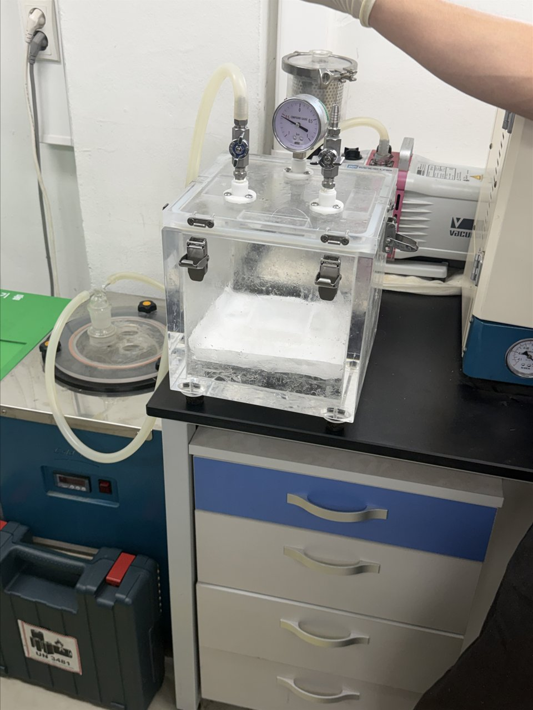

- 사진 확인: 아크릴 챔버 위에 게이지와 볼밸브 2개가 있고, 호스가 뒤쪽 진공 펌프로 이어진다.

| 진공 도달 (게이지 ≈ −1 bar, 밸브 닫힘) | 영상 프레임 | 진공 오븐 |
|---|---|---|
| 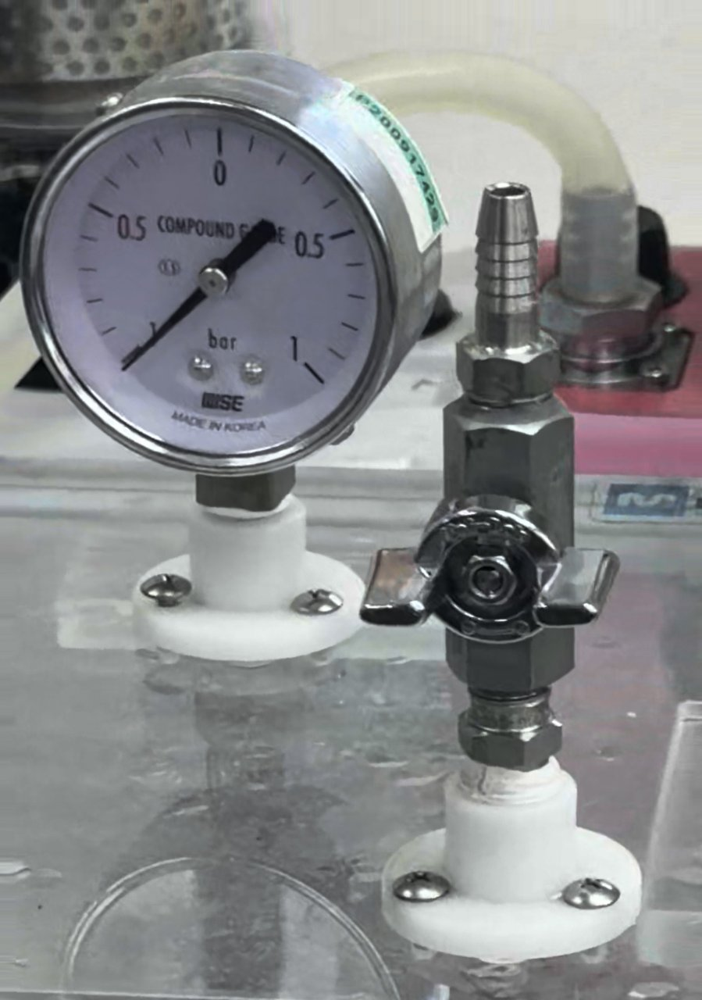 | 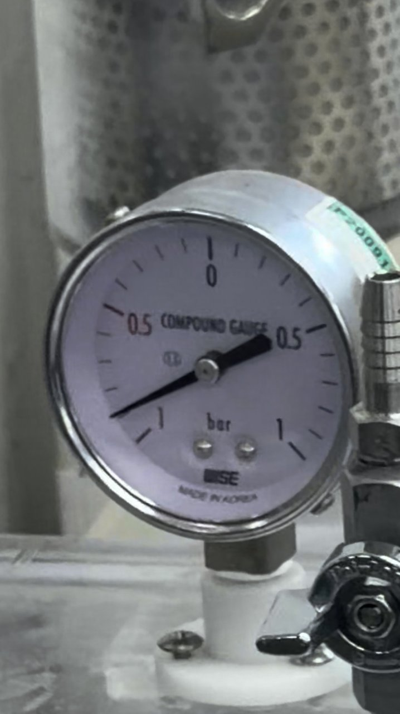 | 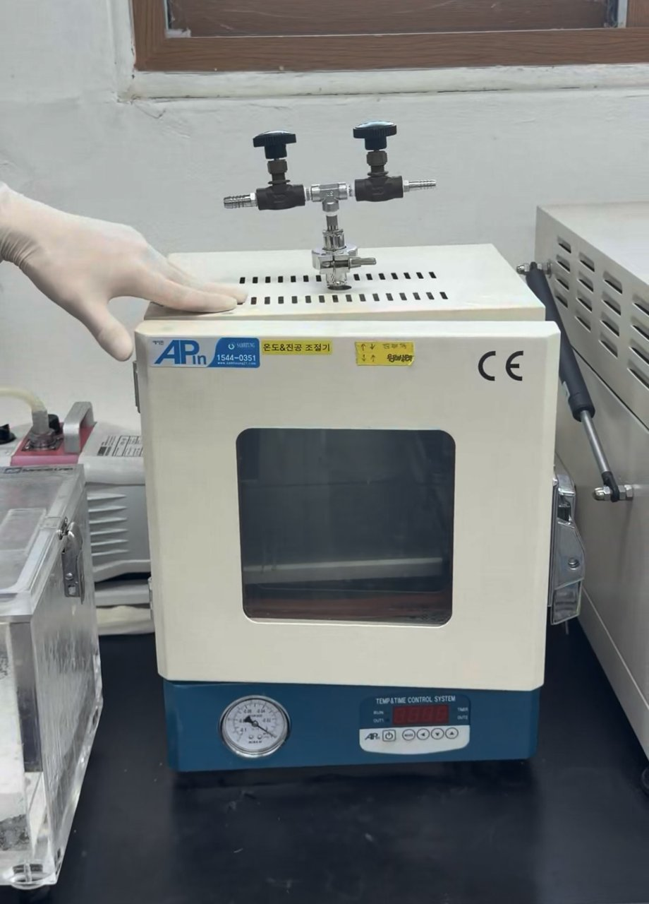 |

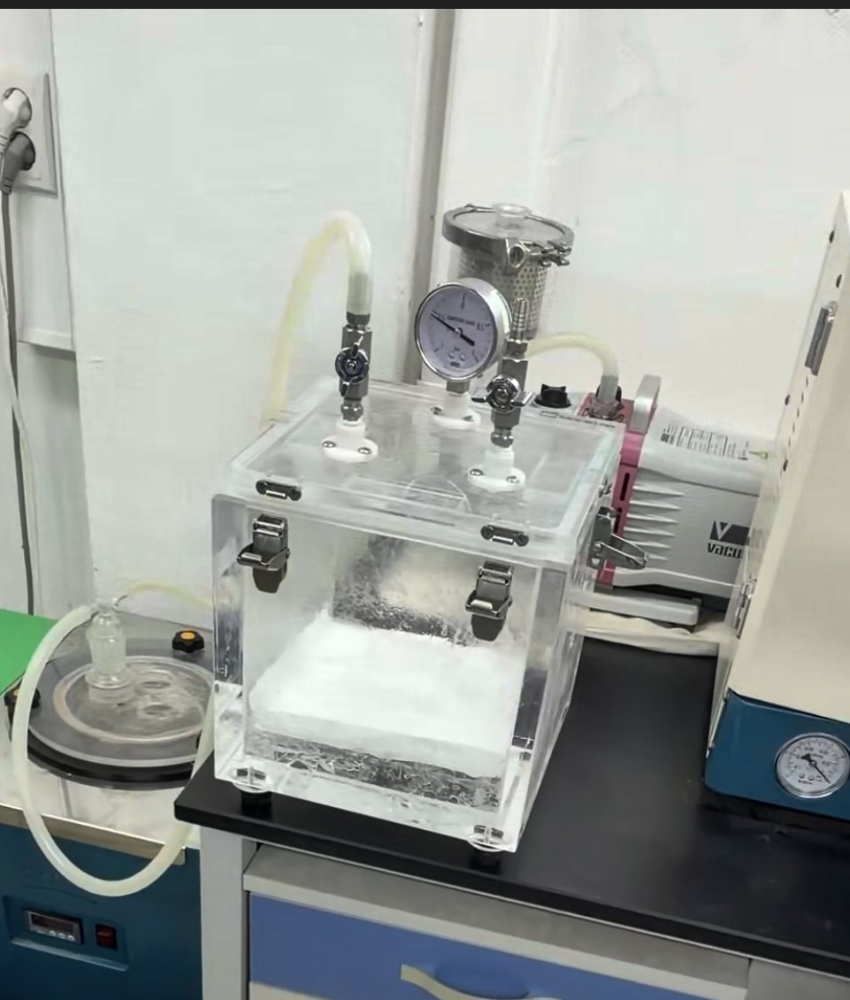

- 사진 확인: 게이지는 **WISE Compound Gauge (bar)** 다. 빨간 0.5 눈금이 있는 왼쪽이 진공 쪽이다. 바늘이 왼쪽 "1" 근처에 있으므로 **약 −1 bar까지 진공이 잡힌 상태**다.
- 사진 확인: 밸브 손잡이가 배관(세로)과 **수직(가로)** 이다. 일반적인 볼밸브 규칙으로는 **닫힌 상태**다. 진공을 잡은 뒤 밸브를 닫아 챔버를 밀폐해 둔 것으로 해석할 수 있다.
- 사진 확인: 오른쪽 장비는 **진공 오븐**이다. 라벨은 **"온도&진공 조절기"**, 패널은 **TEMP & TIME CONTROL SYSTEM** 이고, 게이지 눈금은 MPa 단위(−0.1 MPa = −1 bar)다. 위쪽에 니들밸브 2개가 있다. 수업에서 말한 "온도까지 되는 진공 챔버"가 이것이다. ❓확인: 밸브 2개 각각의 역할 (펌프 연결 / 공기 유입으로 추정)

**원리 심화** `[보충]`
- **게이지압과 절대압:** 게이지는 **대기압을 0으로 놓고** 잰다. 그래서 −1 bar는 "대기압(약 1 bar)만큼 뺐다", 즉 절대압이 0에 가깝다는 뜻이다. 실제 펌프로 완전한 0은 만들 수 없다. 따라서 "거의 진공"으로 쓰는 것이 정확하다.
- **보일의 법칙 계산 예시:** 대기압(약 1 bar)에서 부피가 1인 기포가 있다고 하자. 챔버를 0.1 bar(절대압, 게이지로는 약 −0.9 bar)까지 낮추면 P₁V₁ = P₂V₂ 이므로 부피는 약 **10배**로 커진다. 기포가 커지면 부력이 커져 빨리 떠오르고, 표면에서 터진다.
- **점도가 높을수록 진공이 필요한 이유 (스토크스 법칙):** 작은 기포가 떠오르는 속도는 대략 **기포 반지름의 제곱에 비례**하고 **액체 점도에 반비례**한다.
  - 경화제를 섞은 PDMS는 물보다 수천 배 끈적하다. 그래서 대기압에서는 작은 기포가 거의 떠오르지 못하고 그대로 갇힌다.
  - 감압해서 기포 부피를 10배로 키우면 반지름은 약 2.15배(∛10), 떠오르는 속도는 약 **4.6배**(2.15²) 빨라진다.
  - ❓확인: 이 실험실 PDMS 원료의 혼합 점도 (Sylgard 184 데이터시트 기준 약 3,500 cP)
- **녹아 있던 기체도 빠져나온다:** 압력이 낮아지면 액체에 녹아 있던 공기도 덜 녹는다(헨리의 법칙). 그래서 눈에 안 보이던 기체까지 기포가 되어 빠져나온다.
- **공기를 천천히 넣는 이유:** 압력 차이가 크면 공기가 한꺼번에 들어오면서 시료 표면을 흔든다. 또 게이지와 밸브 같은 장비에도 충격이 간다.
- (출처: Dow *SYLGARD 184 TDS* — 혼합 후 진공 탈포 권장)
- ❓확인: 챔버 안의 흰색 물체가 무엇인지 (PDMS 시료인지, 받침인지)

📷 캡처 필요 #11 — (남음) 탈포 전(기포 많음) / 후(깨끗함) 비교 → **다음 실습(PDMS 회차) 때 촬영**
📷 캡처 필요 #12 — ✅ 위 사진들

## 5. 결과

| 장비 | 한 일 | 관찰·측정값 | 근거 |
|---|---|---|---|
| 마이크로피펫 | 10–100 µL 피펫으로 50 µL를 1.5 mL 튜브에 옮김 (학생 시연) | 용량 창 `050` | 사진 |
| 전자저울 | 수평·영점 확인 후 디쉬를 올려 측정 | 최대 220 g, 최소 표시 단위 0.1 mg, 내부 보정 `CALRUN` 화면 | 사진 |
| pH 미터 | pH 7.00으로 기준을 잡고 pH 4.01·10 완충용액으로 확인 | 완충용액 4.01 / 7.00 확인. **측정값 화면은 미기록** | 사진·녹음 |
| 핫플레이트 교반기 | 마그네틱 바로 교반, 가열 시연 | 가열 전 24.1–24.3 °C, 교반 **500 rpm**, 가열 50 °C 시연 | 사진·녹음 |
| 진공 챔버 | PDMS 혼합물 탈포 | 게이지 **약 −1 bar** 도달 후 밸브를 닫아 유지, 탈포 후 기포가 눈에 띄게 줄어듦 | 사진·녹음 |

## 6. 고찰

> 아래 문단은 팀 검토용 **초안**이다. 수치와 근거는 4·5장에 있는 것만 썼다.

**① 측정 정확도는 "기준 상태"에서 출발한다.** 이번에 다룬 장비는 측정하기 전에 모두 기준을 먼저 맞췄다.
- 피펫은 쓰고 나서 최대 용량으로 되돌려 스프링을 같은 상태로 유지한다.
- 저울은 수평을 맞추고, 영점과 tare로 용기 무게를 지우고, 내부 추로 보정(`CALRUN`)한다.
- pH 미터는 pH 7.00으로 영점을 잡고 4.01·10으로 기울기를 맞춘다.

장비는 달라도 모두 **값을 알고 있는 기준을 먼저 재서, 장비의 치우침(오차)을 빼는 과정**이다. 기준이 틀어진 채로 측정하면 여러 번 반복해도 같은 방향으로 틀린 값(계통 오차)이 나온다. 그래서 반복 측정만으로는 이 오차를 없앨 수 없다.

**② 측정 범위와 분해능의 관계.** 50 µL를 옮길 때 20–200 µL보다 10–100 µL 피펫을 고르는 이유가 있다. 같은 양이라도 **범위의 위쪽**에서 쓸수록 상대 오차가 작기 때문이다. 저울의 "넷째 자리"도 같은 맥락이다. 0.1 mg이라는 분해능은 수 mg 정도의 소량 시료를 잴 때 의미가 커진다. 따라서 표시 단위(g 또는 mg)를 함께 적어야 값을 오해 없이 전달할 수 있다.

**③ 탈포는 압력·부력·점도가 함께 작용한 결과다.** 진공을 걸면 보일의 법칙에 따라 기포가 커진다. 커진 기포는 부력이 커져 표면으로 떠오르고, 표면에서 터진다. PDMS처럼 점도가 높은 액체는 대기압에서는 작은 기포가 거의 떠오르지 못한다. 그래서 감압으로 기포를 키워 떠오르는 속도를 높이는 과정이 필요하다(스토크스 법칙). 기포가 남으면 경화 후 표면이 울퉁불퉁해지고 투명도가 떨어진다. 이것은 다음 회차 PDMS 구조물의 품질과 바로 이어진다.

**④ 한계와 이견.**
- "피펫을 최대 용량으로 보관"하는 효과의 크기는 연구자들 사이에 의견이 갈린다.
- 이번 회차에는 pH 측정값 화면과 탈포 전·후 사진을 기록하지 못했다.
- 다음 회차에는 측정값을 표로 남겨 결과를 정량적으로 비교할 계획이다.

### 고찰 아이디어 (메모)

- **정확도 = 기준 맞추기.** 피펫(최대 용량으로 복귀), 저울(수평·영점), pH 미터(pH 7 보정)는 모두 "측정 전에 기준 상태를 만든다"는 같은 원리를 따른다. 보고서의 중심 줄기로 쓰기 좋다.
- **범위와 오차.** 같은 50 µL라도 범위가 좁은 피펫을 고르는 이유
- **오염 방지와 재현성.** 매 실험을 같은 조건에서 시작해야 하는 이유
- **탈포와 물성.** 기포가 PDMS의 투명도와 표면 평탄도에 미치는 영향 → 다음 회차(PDMS)와 연결

## 7. 확인 필요 목록 (영상·사진으로 확인)

- [x] 저울 표시 자릿수 → d = 0.1 mg (사진)
- [ ] pH 10 표준용액 값
- [ ] 핫플레이트 최대 온도
- [ ] PDMS : 경화제 비율 (10:1?)
- [x] 진공 게이지 단위 → bar, 목표 −1 bar (사진)
- [ ] 밸브 가로·세로 방향 — 규칙은 정리함(일직선=열림, 직각=닫힘), 닫힘 사진은 있음, **열림 사진** 필요
- [ ] 피펫 배출 시 두 번째 멈춤 사용 여부
- [ ] PDMS를 저울로 계량했는지
- [ ] 장비 모델명 — 확인됨: Eppendorf Research plus, Sartorius, DAIHAN / 남음: pH 미터 (배경에 NeoMet 표시가 보임), 진공 펌프

## 참고 자료

- University of Iowa EHS, *Disinfection in laboratories* — https://ehs.research.uiowa.edu/safetymatters-disinfection-laboratories
- Eppendorf, *Research plus Operating manual* — https://www.eppendorf.com/product-media/doc/en/186591/Eppendorf_Liquid-Handling_Operating-manual_Research-plus_Eppendorf-Research-plus.pdf
- ResearchGate, *Is it necessary to reset micropipettes to their maximum volume?* — https://www.researchgate.net/post/Is_it_necessary_to_reset_micropipettes_to_their_maximum_volume
- Eppendorf, *Userguide No.19 — Fundamentals of dispensing* — https://www.eppendorf.com/product-media/doc/en/112927_Userguide/Eppendorf_Liquid-Handling_Userguide_019_Pipettes_Dispensers_Fundamentals-dispensing.pdf
- Gilson Learning Hub, *Positive- vs Air-displacement pipettes* — https://www.gilson.com/default/learninghub/post/what-are-the-benefits-of-positive-displacement-versus-air-displacement-pipettes.html
- Hinotek, *The principle of electromagnetic force compensation* — https://www.hinotek.com/the-principle-of-electromagnetic-force-compensation-in-analytical-balance/
- CASRAI, *Analytical balance calibration guide* — https://casrai.org/guides/analytical-balance-calibration-weighing-technique
- Metrohm, *How to calibrate a pH meter* — https://www.metrohm.com/en/discover/blog/2024/calibrate-pH-meter.html
- USGS, *Field Measurements: pH (A6.4)* — https://pubs.usgs.gov/twri/twri9a6/twri9a64/twri9a_6.4_ver2.0.pdf
- Atlas Scientific, *What is pH slope* — https://atlas-scientific.com/blog/ph-slope/
- Dow, *SYLGARD 184 Silicone Elastomer — Technical Data Sheet* — https://www.dow.com/en-us/pdp.sylgard-184-silicone-elastomer-kit.01064291z.html
- Microlit, *Learn how to extend your pipette's lifespan* — https://www.microlit.us/learn-how-to-extend-your-pipettes-lifespan/
- Camlab, *How should I store my micropipettes?* — https://www.camlab.co.uk/blog/how-should-i-store-my-micropipettes
- Wikipedia, *Ball valve* — https://en.wikipedia.org/wiki/Ball_valve
- Lab Manager, *Degassing high-viscosity epoxies using lab vacuum pumps* — https://www.labmanager.com/degassing-high-viscosity-epoxies-using-lab-vacuum-pumps-35188
