# 실습 03 — 분석·공정 장비 6종 (2026-10-01)

> 상태: 초안 (전사본 + 사진 6장 + 영상 10개 캡처 + 추가 캡처 13장) / 캡처 자리 16개 중 완료 14 / 부분 1 / 남음 1
> 보고서 제출: 조별 1부, 한글 파일, 20쪽 이내, 원리 위주 — 마감 **2026-10-08**
> 원리 심화 `[보충]`은 아직 넣지 않았다. 원문 출처를 확인하면서 추가한다.

## 1. 실습 목적

- `[수업]` 연구실의 분석·공정 장비 6종을 배운다. 교수님 정리: 현미경(마이크로스코프), 인장 시험기, 스핀 코터, UV 경화 챔버(큐어링 챔버), 클린벤치, 오토클레이브.
- `[수업]` 원래 1시간짜리 실습인데 이번에는 2시간으로 나눠 천천히 진행했다.
- 장비 흐름(구성 제안, 교수님이 이렇게 묶은 것은 아님):
  - **만들기**: UV 경화 챔버(나노 패턴 경화), 스핀 코터(패치 위 코팅)
  - **확인·측정**: 현미경(패턴·세포 관찰), 인장 시험기(기계적 강도)
  - **무균 준비**: 오토클레이브(멸균), 클린벤치(무균 작업)

## 2. 공통 주의사항

- `[수업]` 장비마다 전원을 켠 뒤 프로그램을 켜는 순서를 지킨다.
- `[수업]` 세포 실험은 항상 무균 상태에서 한다. 다른 세포나 이물질이 들어가면 실험이 안 된다 (클린벤치·오토클레이브 절).
- `[수업]` UV 경화기는 빛이 몸에 좋지 않으니 쓸 때 항상 조심한다.

| 세포 실험실 전경 |
|---|
| 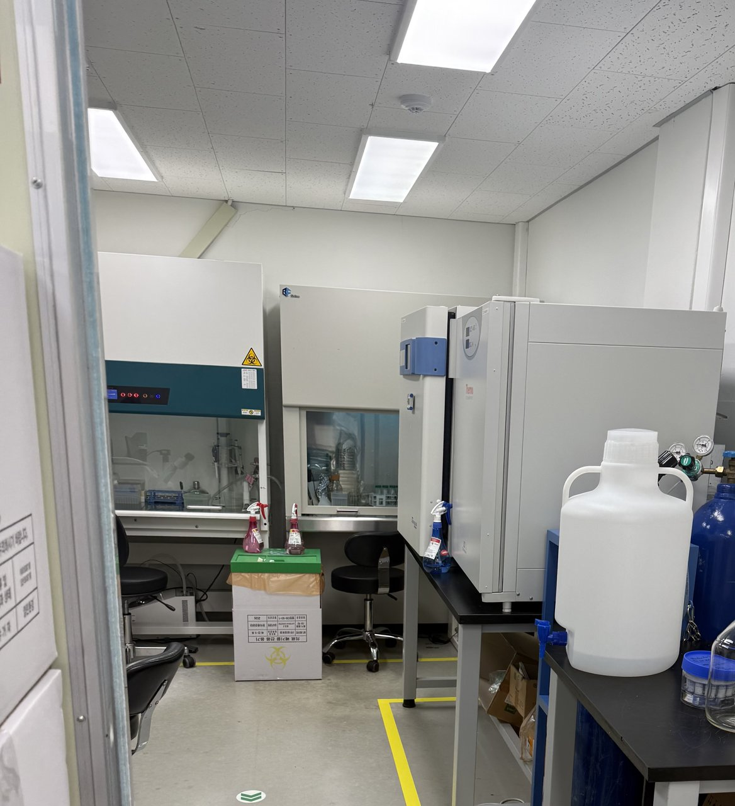 |

- 사진 확인: 세포 실험실 안에 안전 작업대 2대, 인큐베이터(Thermo), CO₂ 가스통, 의료폐기물 전용 용기가 있다.

## 3. 장비 한눈에 보기

| 장비 | 모델 (사진 확인) | 용도 | 핵심 원리 (수업 기준, 보충 예정) |
|---|---|---|---|
| 도립(역상) 현미경 + 카메라 | ZEISS Axio Vert.A1 | 시료·세포·패턴 관찰과 촬영 | 대물렌즈 배율 × 초점(조동·미동) × 광량 조절 |
| 인장 시험기 | A&D MCT-1150, 프로그램 MSAT-Lite | 시료의 인장 강도 측정 | 시료를 위아래로 당겨 하중–늘어난 길이 곡선을 얻고 파단점·최대 하중을 읽음 |
| 스핀 코터 | 동아무역(Dong Ah Tech & Trade) ACE-200 | 패치 위에 용액을 얇고 고르게 코팅 | 진공으로 고정한 시료를 고속 회전시켜 용액을 퍼뜨림 |
| UV 경화 챔버 | UV-A Curing Chamber (서랍형) | 액체 폴리머를 UV로 굳혀 패턴 고정 | UV 경화성 폴리머가 UV를 받으면 굳음 |
| 클린벤치 / 생물안전작업대 | BSC Class II Type A2, BioFree 작업대 | 세포 실험용 무균 작업 공간 | UV 살균 + 팬으로 먼지 유입 차단 |
| 오토클레이브 | DAIHAN Scientific (Digital Fuzzy Control) | 기구·용액 멸균 | 증류수를 고온·고압 증기로 만들어 멸균 (설정 121 °C) |

## 4. 장비별 사용법과 원리

### 4-1. 현미경 (ZEISS Axio Vert.A1) + 카메라 프로그램

**사용 순서** `[수업]`
1. 전원을 켜고 카메라 프로그램을 실행한다. 프로그램 이름은 "아이캠"으로 들림. ❓확인: 정확한 프로그램 이름
2. 관찰할 시료(세포, 물질)를 플레이트나 슬라이드에 담아 재물대에 올린다.
3. 대물렌즈 배율을 고른다. 빨간색 ×5, 그다음 ×10, ×20, ×40 (렌즈에 배율이 적혀 있음). 이번에는 ×10으로 봤다.
4. **조동나사**(크게 움직임)로 상을 대략 맞추고, **미동나사**(미세하게 움직임)로 초점을 정확히 맞춘다.
5. 광량 조절 손잡이로 빛의 세기를 맞춘다.
6. 프로그램에서 촬영한다.

- `[수업]` 정리: 전원 → 시료 올리기 → 조동·미동나사로 상 맞추기 → 광량 조절 → 촬영. 깔끔하게 찍어야 좋은 데이터가 나와 논문에 쓸 수 있다.
- `[수업]` 나노 패턴은 크기가 너무 작아서 이 현미경으로는 잘 보이지 않는다.

| 현미경 전체 | 재물대와 집광부 | 재물대 아래 대물렌즈 회전판 |
|---|---|---|
| 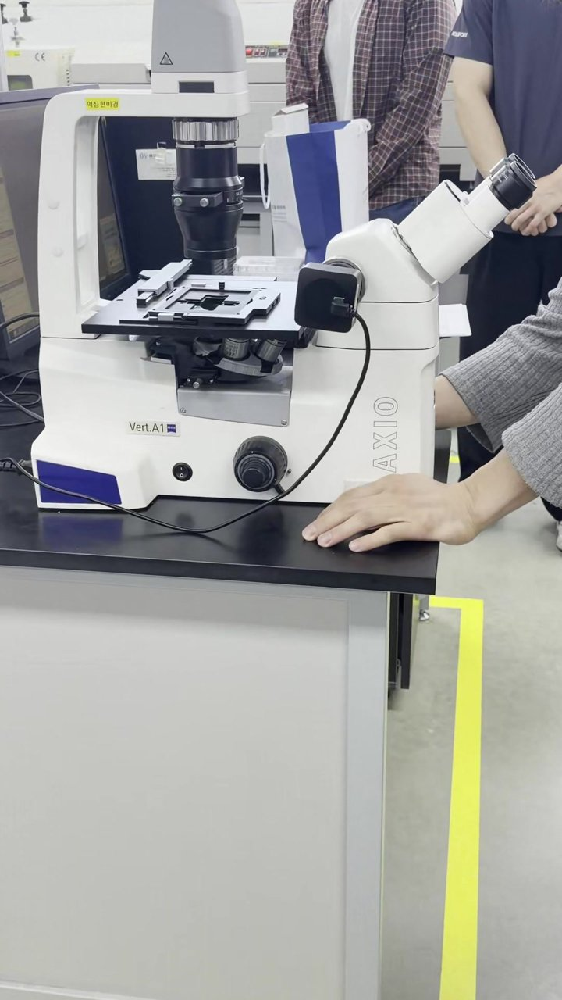 | 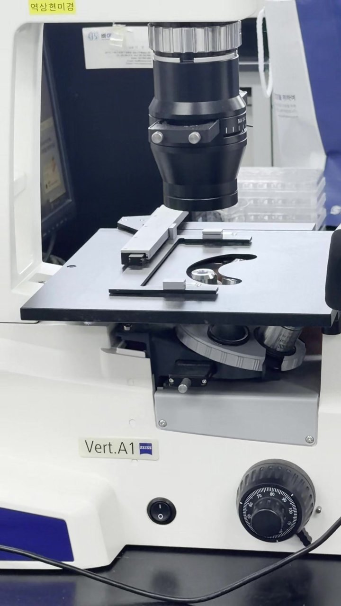 | 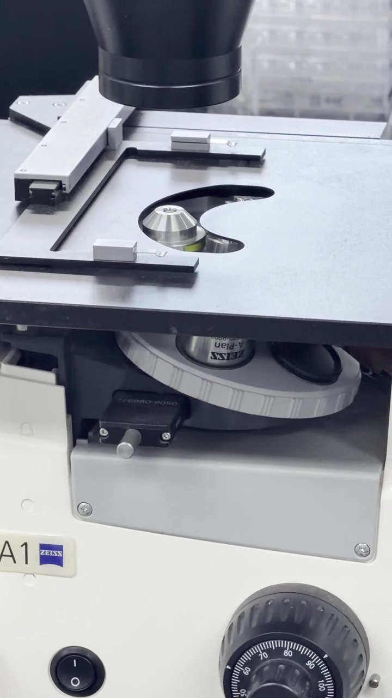 |

- 사진 확인: 모델은 **ZEISS Axio Vert.A1**이다. 대물렌즈가 재물대 **아래**에 있고 조명(집광부)이 위에 있는 **도립(inverted) 현미경**이다. 장비에 노란 라벨("역상현미경"으로 보임 ❓)이 붙어 있다.
- 사진 확인: 대물렌즈 회전판에 ZEISS 렌즈가 여러 개 달려 있고, 초점 손잡이는 본체 옆에 있다. 대물렌즈 배율 숫자는 사진에서 읽히지 않는다.
- 사진 확인: 오른쪽에 카메라가 달려 있고 케이블이 PC로 이어진다.
- 보고서 메모: 도립 현미경은 배양 접시 바닥에 붙은 세포를 아래에서 볼 수 있다. 세포 실험실과 함께 쓰는 이유로 연결할 수 있다. `[보충 예정]` 원문 확인 필요

**보여준 시료와 사진** `[수업]`
- **나노 패턴 PET 필름:** UV 경화성 폴리머(폴리우레탄 계열로 들림)와 실리콘 웨이퍼를 써서 나노 패턴을 입힌 PET 필름이다. 빛을 비추면 무지개처럼 반짝인다(4-4 사진). ❓확인: "폴리탄 Q 성질", "릴링"이 정확히 무엇인지
- **반짝이는 이유 (질의응답):** 패턴이 아주 얇고 미세해서 빛의 파장과 맞물려 색이 갈라져 보인다. `[보충 예정]` 회절격자·구조색 원리로 보강
- **식물 조직 사진:** 미리 찍어둔 사진. ❓확인: 어떤 식물 조직인지
- **dECM 위 나노 패턴:** 돼지 피부·장기처럼 콜라겐이 많은 조직을 탈세포화해 깨끗한 상태로 만든 것(dECM으로 추정, 전사본은 "DCM"). 그 위에 나노 패턴을 입혀 한 방향으로 정렬시켰다. 패턴이 정렬돼 있어야 세포가 잘 자란다. ❓확인: 탈세포화 방법, dECM이 맞는지
- **파티클:** 약 100 µm 크기로 들림 ❓. 농약에 입자를 입혀 식물 생장에 쓰는 연구 예. 나중에 실습에서 다시 배운다.

📷 캡처 필요 #3 — (부분) 대물렌즈 배율 표시 클로즈업 (×5 빨간색 등). 회전판은 찍혔지만 숫자가 안 보임
📷 캡처 필요 #5 — (남음) 프로그램 화면에 뜬 관찰 사진 (dECM 정렬 패턴 또는 식물 조직)

### 4-2. 인장 시험기 (A&D MCT-1150)

**왜 하는가** `[수업]`
- 인장 강도는 시료가 위아래로 당겨질 때 견디는 강도다.
- 예: 장기는 계속 일정한 압력을 받는다. 재료의 기계적 성질이 약하면 금방 끊어지고, 좋으면 오래 유지된다. 그래서 어떤 재료가 얼마나 버티는지 시험한다. ❓확인: 전사본의 "키스/기 테스트"가 무엇을 말한 것인지 (기계적 강도로 추정)
- 이번 실습에서는 인장 시험을 수행했으며, 압축 시험은 수행하지 않았다. (질의응답에서도 이번 시험은 시료를 위아래로 당기는 방식만 다룬다고 설명했다.)

**사용 순서** `[수업]`
1. 선을 연결하고 전원을 켠 뒤 프로그램을 켠다.
2. 시료 정보를 정확히 입력한다. 시료 형태는 rod/plate 중 **plate**로 정하고, 시험 횟수(test count)와 높이·두께·길이를 넣는다.
3. 시료를 위아래 그립에 고정한다. 프로그램으로도, 본체로도 위치를 조절할 수 있다. 시험 중에 밀리지 않게 최대한 꽉 조인다.
4. 위 그립과 아래 그립의 가운데 중심점이 일직선으로 맞아야 하고, 잡는 거리가 같아야 한다.
5. 늘어난 길이(Extension)와 하중(Load)을 **0으로 맞춘 뒤** 시작한다. 매 시험을 **항상 같은 자리(0.0)에서** 시작해야 시료 사이 편차가 없다. 다음 시료를 시험할 때도 다시 0으로 만든 뒤 START를 누른다.
   - 사진 확인: 프로그램 왼쪽 위에 **Clear extension**(늘어난 길이를 0으로) 버튼과 **Force ReZERO**(하중을 0으로) 버튼이 있다. 시험 전 화면은 Extension 0.0 mm, Load 0.00 kgf, Time 0.00 sec, Test count 0/1이다.
6. 시험 속도(test speed)를 정한다. 처음엔 천천히 하다가 맞는 속도를 찾고, 보통 규격에 맞춰 정한다.
7. START → 시료가 늘어나다 끊어지는 점이 **파단점**이다.
8. 다음 시료를 끼우기 전에 위·아래 그립에 **끊어진 시료 파편이 남아 있지 않은지 확인하고 완전히 제거**한다. 그다음 다시 0으로 맞추고 시험한다. `[실습 관찰]`

**결과 읽기** `[수업]`
- 그래프 축 `[수업]`
  - **x축: 늘어난 길이** (elongation, mm). 시료가 처음보다 얼마나 늘어났는지를 나타낸다. 처음 길이로 나눠 백분율로 바꾸면 변형률(strain, %)이다.
  - **y축: 하중** (load, N 또는 kgf). 시료를 당기는 데 얼마나 힘을 가했는지를 나타낸다. 이 하중을 시료 단면적으로 나누면 강도(응력 stress, MPa)가 된다.
  - 사진 확인: 프로그램 그래프의 y축 이름은 **Stress (MPa)**다. 하중을 단면적(너비 × 두께)으로 나눈 값으로 그린 것이다. 하중과 응력은 단면적만큼만 차이가 나서 곡선 모양은 같다.
  - 시험 전에 0.0으로 맞춰 두어야 그래프가 원점 (0, 0)에서 시작한다.
- 최대 하중점(가장 높은 점), 최저점, 파단점(break point)이 나온다.
- 같은 시료를 최소 5~10개 만들어 반복 시험하고, 평균값을 내서 막대그래프 등으로 나타낸다. 한 번만 하면 결과가 얼마나 정확한지 알 수 없다.
- 이전에 저장한 시험 데이터도 다시 열 수 있다.
  - 사진 확인: 바탕화면에 시험 프로그램 **MSAT-Lite** 아이콘과 별도의 **데이터 검색 프로그램** 아이콘(돋보기 모양, 이름은 "DBSearchLite"로 보임 ❓)이 나란히 있다.
  - 사진 확인: 검색 창(Search database)에서 시료 이름·작업자·날짜로 과거 시험을 찾을 수 있고, 목록에 시험 종류(Tension test), 시험 날짜, 시료 이름, 작업자, 시험 속도, 시험 횟수가 쌓여 있다. 아래에 Open, CSV output, Print, Delete 버튼이 있어 결과를 다시 열거나 CSV로 내보낼 수 있다.

**이번 시료** `[수업]`
- PDMS(폴리디메틸실록산, 실리콘 계열 열경화성 물질). 몰드에 부어 굳힌 뒤 떼어낸 것. 다음 실습에서 직접 만든다.

| 시험기 전체 | 그립에 고정한 시료 | 조작 패널 |
|---|---|---|
| 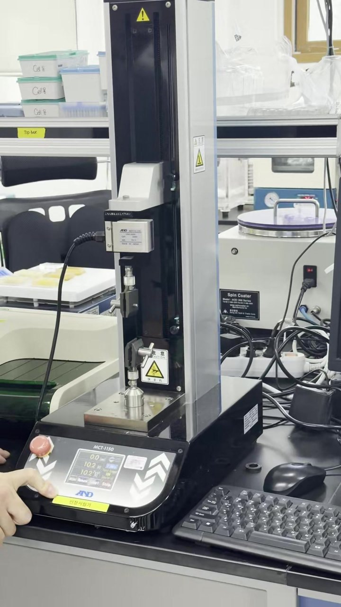 | 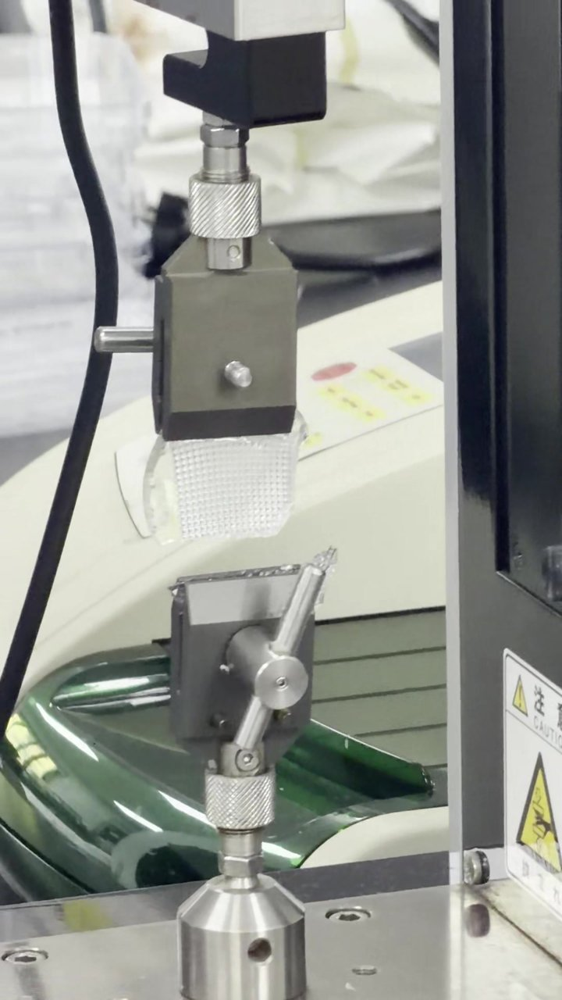 | 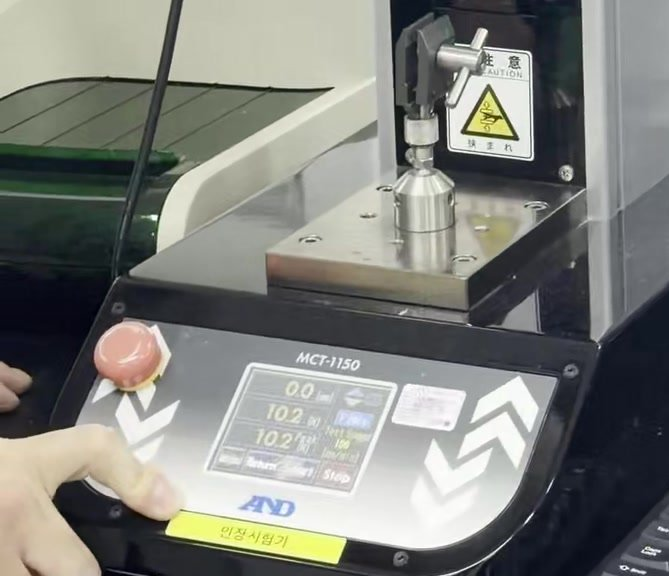 |

| 그립에 물린 투명 시료 (가까이) | 그립 위치 조정 | 시료가 늘어나다 끊어진 모습 |
|---|---|---|
| 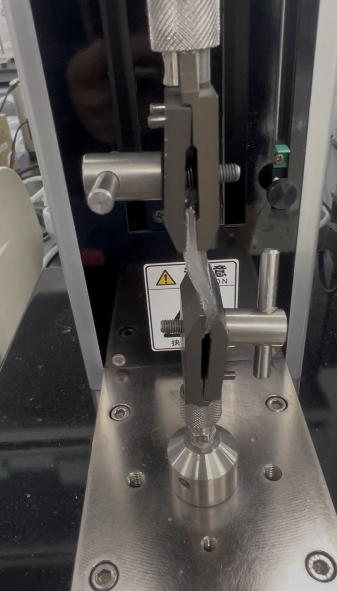 | 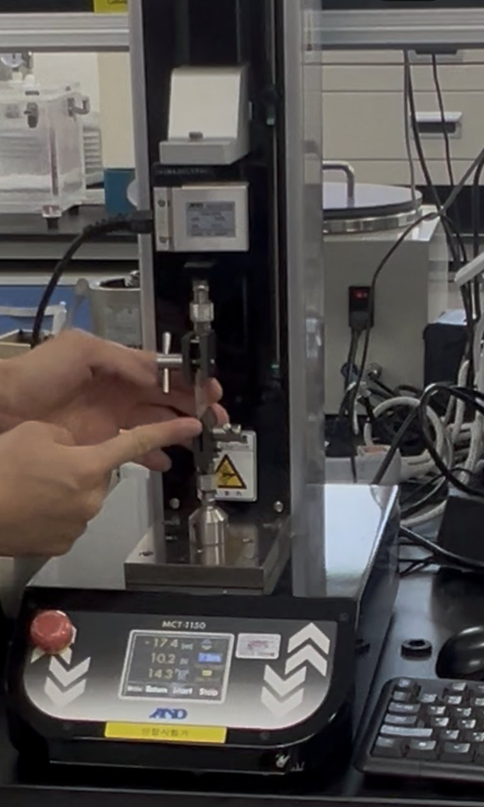 | 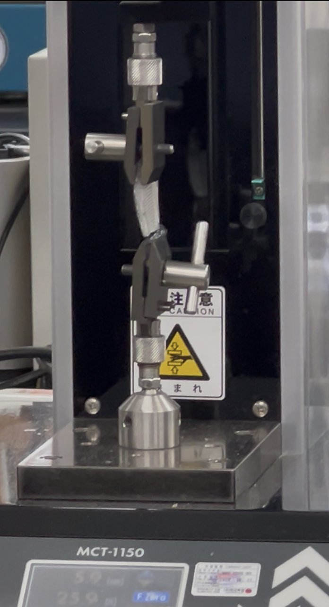 |

| 시험 전 설정 화면 (0 맞추기·시료 치수·속도) | 시험 속도 선택 목록 |
|---|---|
| 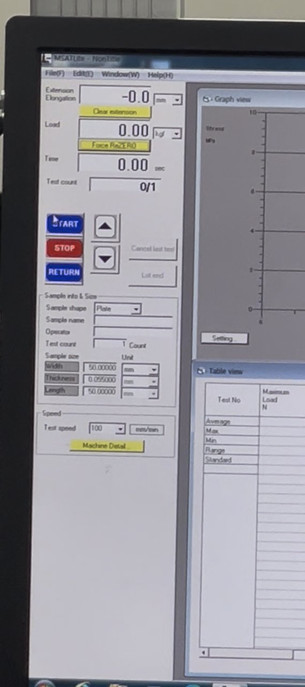 | 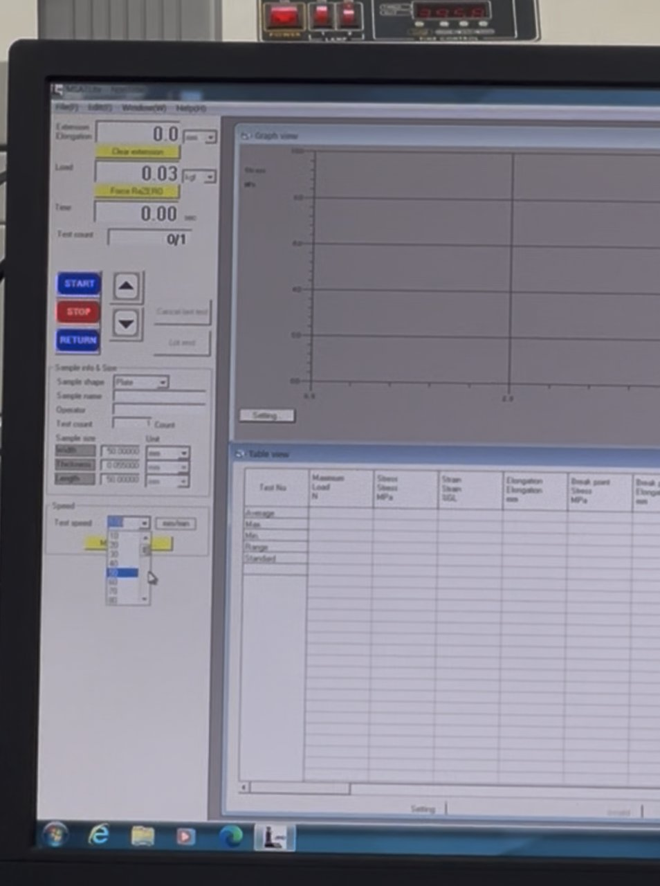 |

| 시험 결과 (응력–변형률 곡선과 결과 표) | 과거 시험 데이터 검색 창 |
|---|---|
| 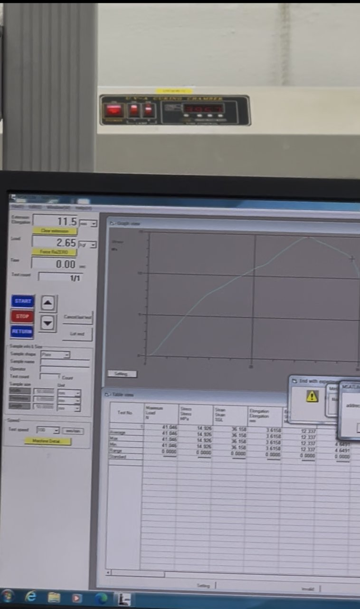 | 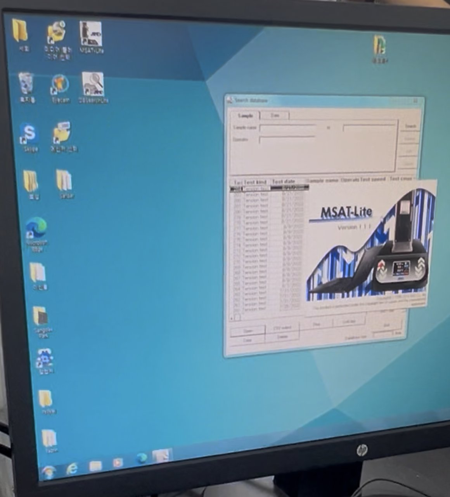 |

| 실패한 시험의 그래프 | 실패한 시험의 결과 표 |
|---|---|
| 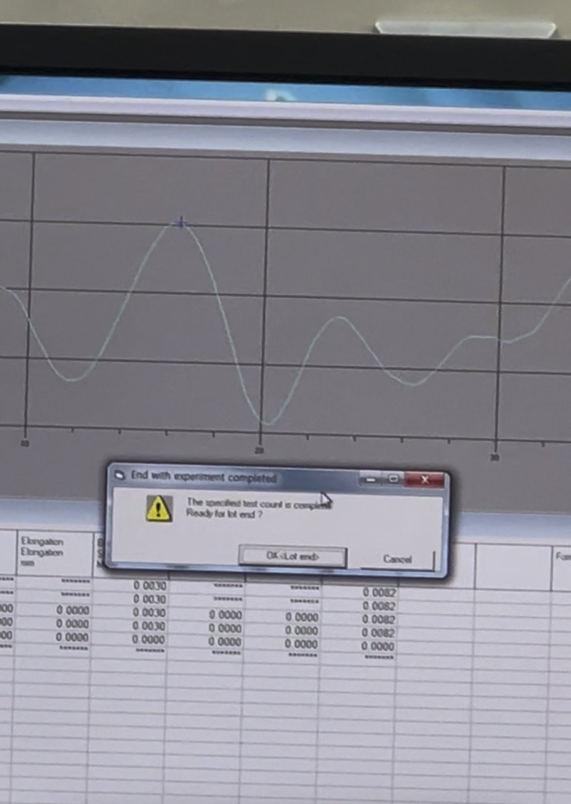 | 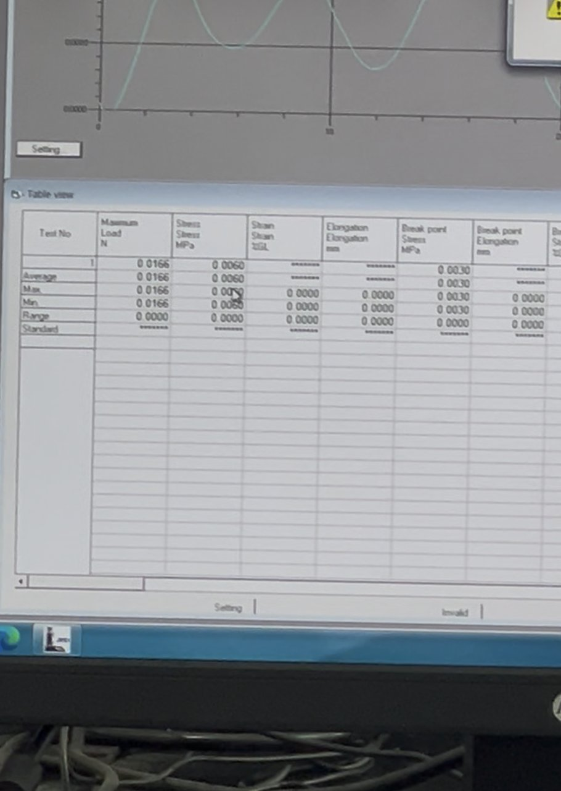 |

| 시험 프로그램 첫 화면 |
|---|
| 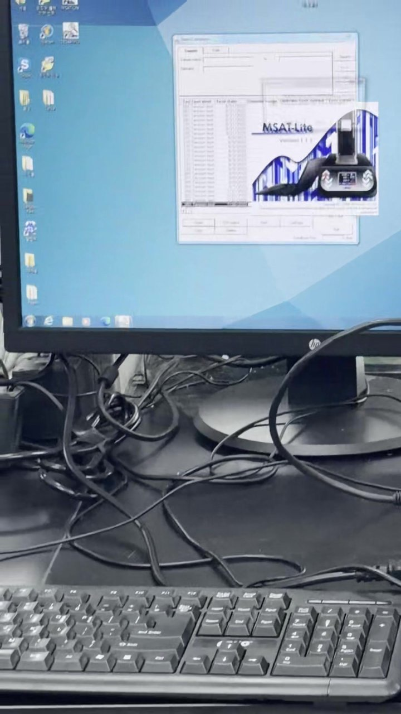 |

- 사진 확인: 모델은 **A&D MCT-1150**이고, 노란 라벨에 "인장시험기"라고 적혀 있다. 기둥 위쪽에 하중 센서(로드셀)가 있고, 아래위 그립 사이에 시료를 문다.
- 사진 확인: 영상 속 그립에는 흰색 격자 무늬 막이, 추가 캡처에서는 투명한 띠 모양 시료가 물려 있다. 투명한 시료는 당기는 동안 늘어나다 아래 그립 근처에서 끊어졌다. ❓확인: 두 시료 중 어느 것이 PDMS인지
- 사진 확인: 조작 패널 화면에 0.0 / 10.2 / 10.2 같은 숫자가 뜬다. ❓확인: 각 숫자의 항목과 단위
- 사진 확인: 시험 프로그램은 **MSAT-Lite**이고, 저장된 시험 목록에 "Tension test", 시험 날짜, 시료 이름, 시험 속도, 시험 횟수 열이 있다. 수업에서 말한 "이전 데이터를 다시 열 수 있다"가 이 화면이다.
- 사진 확인: 시연 중 프로그램에 오류 창이 떠서 다시 실행하는 장면이 있다 (수업에서도 "지금 적당히 안 나온다"고 언급).

**시험 설정값 (화면 그대로)**

| 항목 | 값 |
|---|---|
| 시료 형태 (Sample shape) | Plate |
| 시료 치수 (Width × Thickness × Length) | 50 mm × 0.055 mm × 50 mm |
| 시험 속도 (Test speed) | 100 mm/min (목록에 10~80 등 선택지) |
| 시험 횟수 (Test count) | 1 |

- ❓확인: 치수 50 × 0.055 × 50 mm가 실제로 잰 값인지, 프로그램에 남아 있던 값인지. 두께 0.055 mm(55 µm)는 필름 수준이라 PDMS 시료로 보기에는 얇다.

**시험 결과 (화면 그대로, 1회 시험)**

| 항목 | 값 |
|---|---|
| 최대 하중 (Maximum Load) | 41.046 N |
| 응력 (Stress) | 14.926 MPa |
| 변형률 (Strain) | 36.158 %GL |
| 늘어난 길이 (Elongation) | 3.6158 mm |
| 파단점 응력 (Break point Stress) | 12.337 MPa |
| 파단점 늘어난 길이 (Break point Elongation) | 4.6491 mm |

- 계산 확인 (코드로 재계산):
  - 단면적 = 너비 × 두께 = 50 × 0.055 = 2.75 mm²
  - 응력 = 최대 하중 / 단면적 = 41.046 N / 2.75 mm² = **14.926 MPa** → 화면 값과 같다
  - 변형률 36.158 % = 3.6158 mm / 10 mm → 프로그램이 **기준 길이(gauge length) 10 mm**로 계산한 것으로 보인다. ❓확인: 시료 길이(50 mm)와 다른 이유 (그립 사이 거리일 가능성)
  - 파단점 하중 = 12.337 MPa × 2.75 mm² ≈ 33.9 N → 최대 하중을 지난 뒤 힘이 줄어들다 끊어졌다.
- 반복 횟수가 1회라서 Average·Max·Min이 모두 같고 Range는 0이다. 수업에서 말한 5~10회 반복을 하면 이 칸에 차이가 생긴다.

**실패한 시험** (사진 확인)
- 다른 시험에서는 최대 하중이 **0.0166 N**, 응력이 0.0060 MPa로 거의 0이었고, 그래프가 물결 모양으로 오르내렸다.
- 하중이 거의 걸리지 않았으므로 시료가 제대로 물리지 않았거나 그립에서 미끄러진 것으로 보인다(추정). 수업의 "이렇게 떨어지면 안 되는 건데", "지금 적당히 안 나온다"는 말과 맞는다.
- 같은 자리(0.0)에서 시작하고 그립을 꽉 조여야 하는 이유를 보여주는 예로 고찰에 쓸 수 있다.

**초기 위치 0.0 맞추기** `[수업]`
- 시료를 그립에 고정한 뒤, 시험을 시작하기 전에 늘어난 길이와 하중을 모두 **0.0**으로 맞춘다. 프로그램의 **Clear extension**(늘어난 길이 → 0)과 **Force ReZERO**(하중 → 0)를 누른다.
- 이유: x축의 늘어난 길이는 시작 위치를 기준으로 잰다. 시작 위치가 시료마다 다르면 같은 시료라도 늘어난 길이와 변형률이 다르게 기록된다. 하중도 시료를 끼우면서 생긴 작은 힘이 남아 있으면 그만큼 값이 치우친다.
- 그래서 수업에서는 "항상 같은 위치(0)에서 시작해야 편차가 없다"고 강조했다. 5~10회 반복 시험을 할 때도 매번 다시 0으로 맞춘 뒤 START를 누른다.

**시료 파편 제거** `[실습 관찰]` (팀원 확인)
- 시료가 끊어진 뒤 그립 안쪽에 남은 파편이 쉽게 빠지지 않았다. 다음 시료를 끼우기 전에 파편이 완전히 제거됐는지 확인한 뒤 시험해야 한다.
- 사진 확인: 끊어진 시료 사진에서 아래 그립 쪽에 찢어진 시료 조각이 물려 있다.
- 이유 (추정): 파편이 남으면 새 시료가 그립 면에 고르게 닿지 않는다. 그러면 시험 중 시료가 미끄러지거나 중심이 어긋나 하중이 고르게 걸리지 않을 수 있다. 앞에서 정리한 "그립을 꽉 조이고 위·아래 중심을 맞춘다"는 조건과 같은 이유다.

📷 캡처 필요 #7 — ✅ 설정 화면 사진
📷 캡처 필요 #9 — ✅ 끊어진 시료 사진
📷 캡처 필요 #10 — ✅ 결과 그래프·표 사진

### 4-3. 스핀 코터 (ACE-200)

**용도** `[수업]`
- PDMS로 만든 원형 패치 위에 콜라겐 등을 얇게 코팅해 세포에 더 좋은 환경을 만든다. ❓확인: 콜라겐 외에 언급한 코팅 물질 (두 전사본 모두 "그래픽"·"신나씨"·"쳐나시면" 등으로 들림)

**사용 순서** `[수업]`
1. SYSTEM POWER를 켜고, 필요한 버튼을 켠다.
2. PROG(프로그램)를 누르고 쓸 프로그램 번호를 고른 뒤, RPM과 시간을 정한다. 이 연구실은 **3,500 rpm**을 많이 쓴다. 실험으로 미리 찾아둔 최적값이다.
3. ENT로 설정을 적용한다.
4. 패치를 척 위에 잘 올리고 VACUUM으로 진공을 잡아 고정한다.
5. START → 회전하는 패치 위에 피펫 팁으로 콜라겐을 조금씩 떨어뜨린다. 회전하면서 용액이 전체로 얇게 퍼진다.
6. 정한 시간이 끝나면 STOP, 진공을 끈다. 패치를 꺼내고 튄 용액을 닦는다.

| 패치에 코팅액을 떨어뜨리는 장면 | 조작 패널 |
|---|---|
| 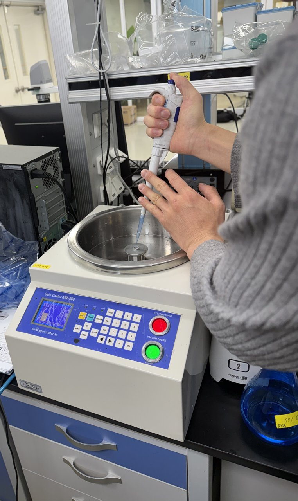 | 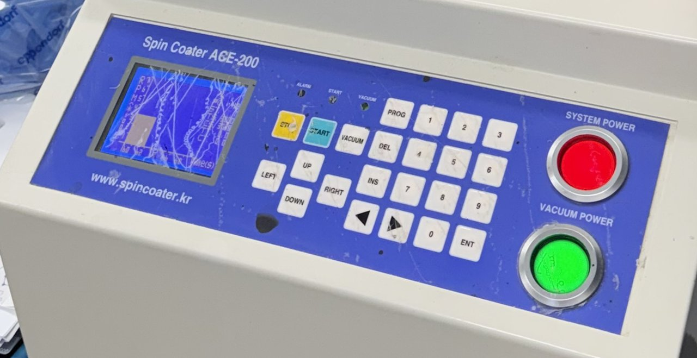 |

| 뒷면 명판 (진공 호스 연결부) |
|---|
| 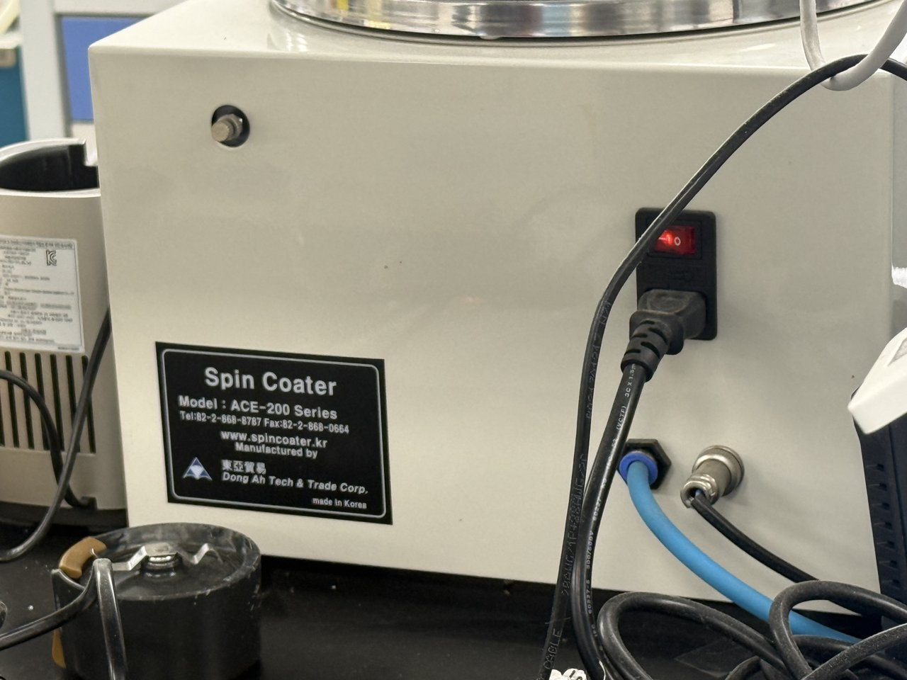 |

- 사진 확인: 모델은 **Spin Coater ACE-200** (동아무역, Dong Ah Tech & Trade Corp.)이다.
- 사진 확인: 패널에 PROG, START, STOP, VACUUM, ENT, 숫자 키가 있고, 오른쪽에 **SYSTEM POWER**(빨강)와 **VACUUM POWER**(초록) 버튼이 따로 있다. 화면에 RPM과 시간(s) 항목이 보인다.
- 사진 확인: 뒷면에 파란 진공 호스가 연결돼 있다. 진공으로 시료를 척에 붙여 고정한다는 수업 설명과 맞는다.
- 사진 확인: 코팅액은 100–1000 µL 피펫으로 척 가운데 패치 위에 떨어뜨린다. 2회차에 배운 피펫이 여기서 쓰인다.
- ❓확인: 코팅 시간(초)

### 4-4. UV 경화 챔버 (UV-A Curing Chamber)

`[수업]`
- UV를 쬐어 UV 경화성 폴리머(폴리우레탄 계열)를 빠르게 굳히는 장비다.
- 패턴을 만들 때 폴리머는 액체라 그대로는 굳지 않는다. 챔버에 넣고 UV를 쬐면 굳어서 패턴이 고정된다. 나노 패턴 PET 필름도 이렇게 만들었다.
- UV는 몸에 좋지 않으니 항상 조심한다.

| 램프를 켠 서랍 (파란 빛) | 챔버와 나노 패턴 필름 | 빛에 반짝이는 나노 패턴 필름 |
|---|---|---|
| 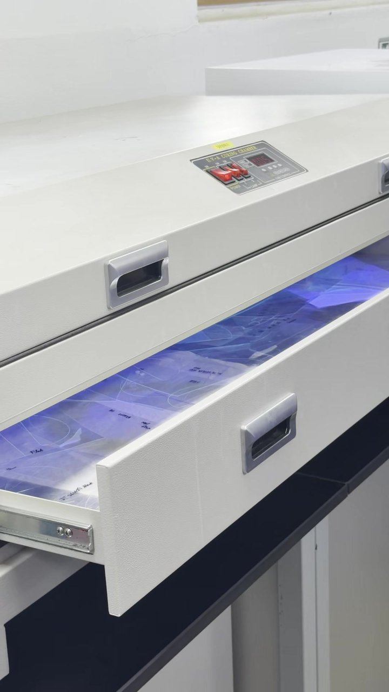 | 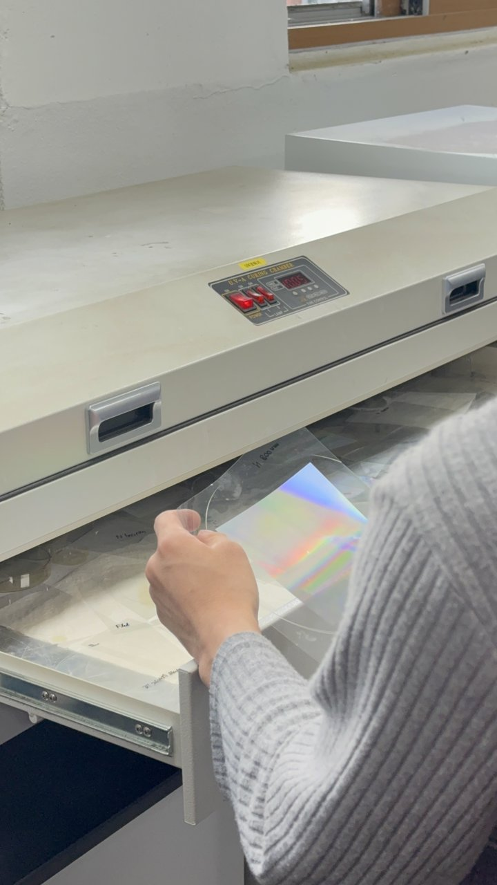 | 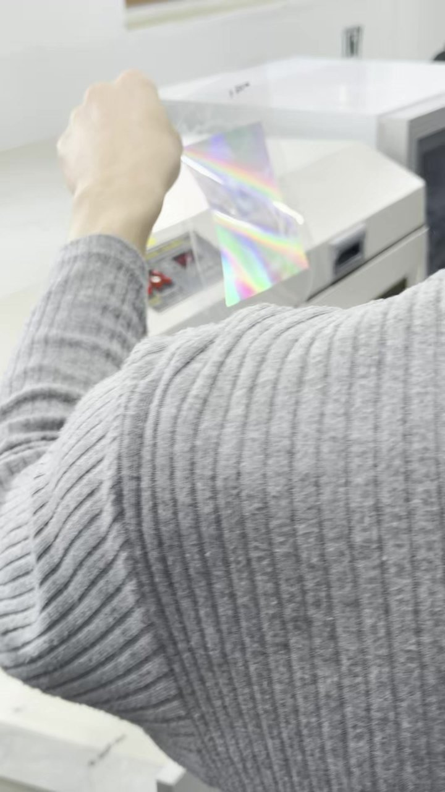 |

- 사진 확인: 패널에 **U.V-A CURING CHAMBER**라고 적혀 있다. POWER 스위치와 LAMP 1·2 스위치, 디지털 타이머(TIME CONTROL)가 있다.
- 사진 확인: 서랍형이다. 램프가 켜지면 서랍 안이 파랗게 빛난다.
- 사진 확인: 서랍 안에 여러 필름이 놓여 있고, 꺼낸 필름은 보는 각도에 따라 무지개색으로 반짝인다. ❓확인: 필름에 손글씨로 적힌 표시("N 600", "N 800" 등 패턴 크기로 보임)
- ❓확인: UV 파장(UV-A 범위), 경화 시간

### 4-5. 클린벤치 / 생물안전작업대

`[수업]`
- 세포 실험을 할 때 쓰는 무균 작업 공간이다.
- 안을 UV로 살균하고, 팬으로 먼지가 들어오지 않게 계속 막는다.
- 세포 실험 전용이다. 먼지가 생기는 다른 실험은 하지 않는다.

| 생물안전작업대(왼쪽), 작업대(가운데), 인큐베이터(오른쪽) |
|---|
| 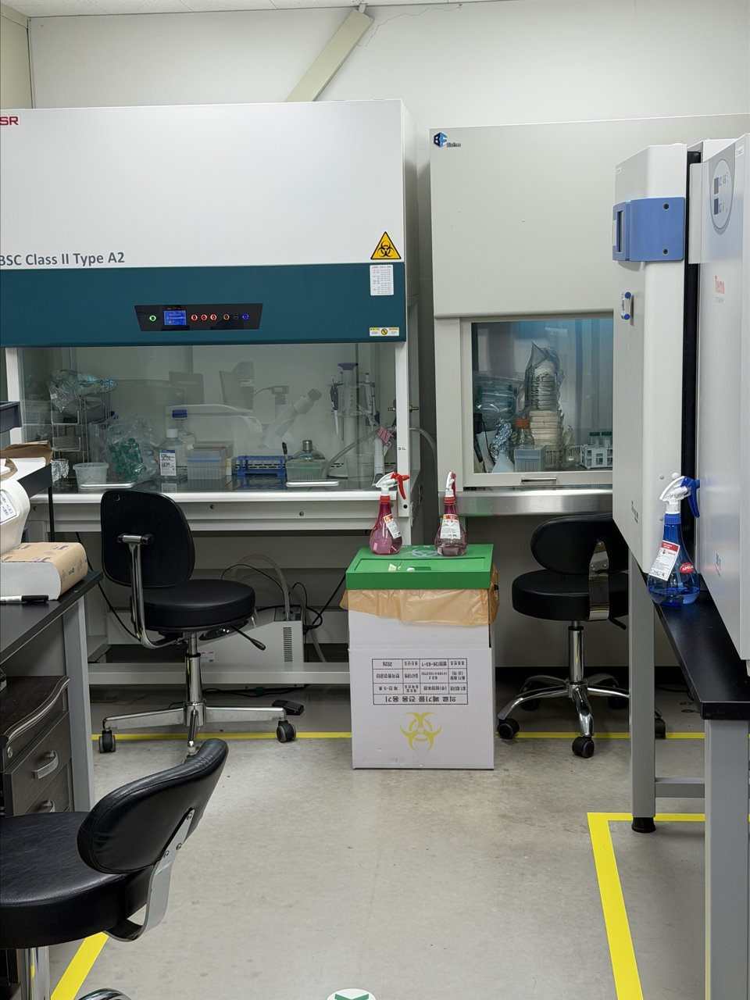 |

- 사진 확인: 왼쪽 장비에는 **BSC Class II Type A2**(생물안전작업대, Biological Safety Cabinet)와 생물위해 표시가 붙어 있다. 가운데는 BioFree 제품 작업대, 오른쪽은 Thermo 인큐베이터다.
- ❓확인: 교수님이 "클린벤치"라고 한 것이 어느 장비인지. 클린벤치와 생물안전작업대는 공기 흐름과 보호 대상(시료만 / 시료와 작업자)이 달라서 보고서에서 구분해 쓸 필요가 있다. `[보충 예정]`

### 4-6. 오토클레이브 (DAIHAN Scientific)

`[수업]`
- 고온·고압 증기로 기구·용액을 멸균하는 장비다.
- 수돗물이 아니라 증류수(정제수)를 넣어 쓴다. ❓확인: 전사본 "직류/직수"를 증류수로 해석함
- 기본 설정값이 들어 있어서 시작만 누르면 타이머와 온도가 알아서 올라간다. 설정 온도는 **121 °C**다.
- **멸균 확인 테이프:** 멸균할 물건에 테이프를 붙여 넣는다. 처리 전 색이던 줄무늬가 열을 받으면 검은색으로 바뀌어 멸균이 됐음을 확인할 수 있다.
  - 사진 확인: 처리 전 테이프는 연한 바탕에 **연두색 사선 줄무늬**다. 전사본의 "소록 색깔"은 이 연두색을 말한 것으로 보인다.
  - 사진 확인: 멸균을 마친 용기 뚜껑에 붙은 테이프는 줄무늬가 **검은색**으로 바뀌어 있다.
  - 이 테이프는 정해진 온도에 닿았다는 것만 보여준다. 멸균 시간이 충분했는지까지 보장하지는 않는다. `[보충 예정]` 원문 확인 필요

| 오토클레이브 | 설정 화면 (121.2 °C) | 용기에 물을 담아 넣는 장면 |
|---|---|---|
| 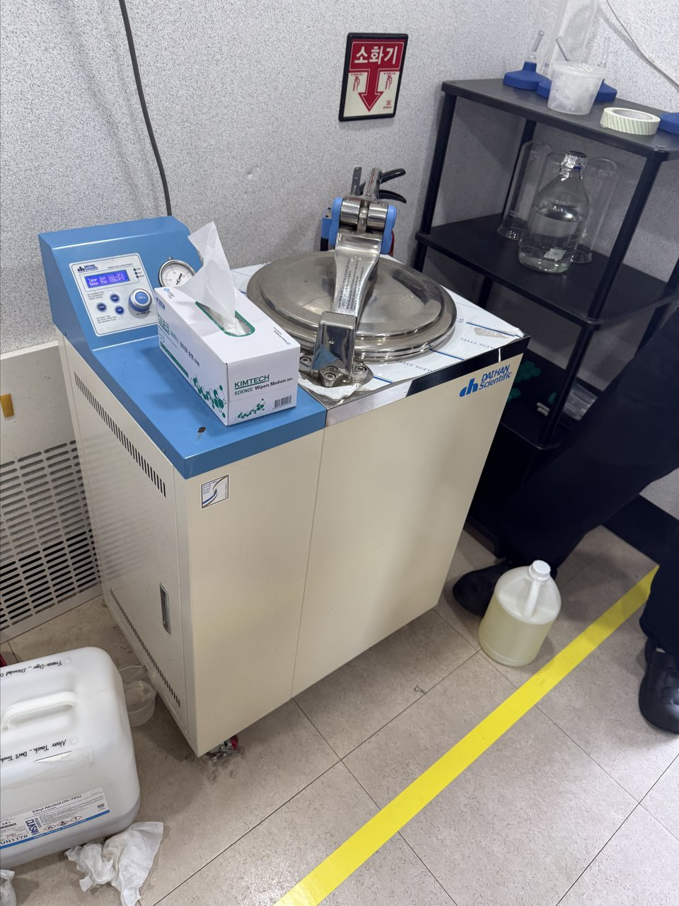 | 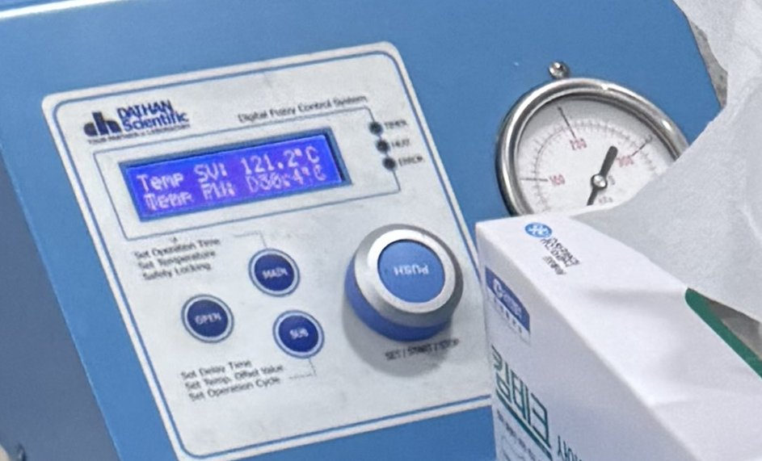 | 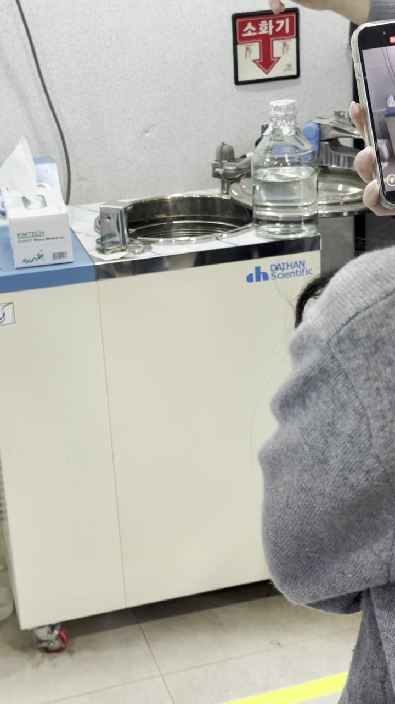 |

- 사진 확인: **DAIHAN Scientific** 제품으로, 패널에 **Digital Fuzzy Control System**이라고 적혀 있다. 화면 윗줄 **Temp SV 121.2 °C**는 설정 온도, 아랫줄 Temp PV는 현재 온도로 보인다.
- 사진 확인: 패널 옆에 압력 게이지가 있고, 버튼 설명에 Set Operation Time / Set Temperature / Safety Locking이 적혀 있다. 시간·온도·잠금을 설정하는 구조다.
- 사진 확인: 뚜껑은 손잡이를 돌려 잠그는 방식이다. 옆 선반에 멸균 확인 테이프 롤이 보인다.

| 멸균 전 테이프 (연두색 사선) | 멸균 후 테이프 (검은 줄) |
|---|---|
| 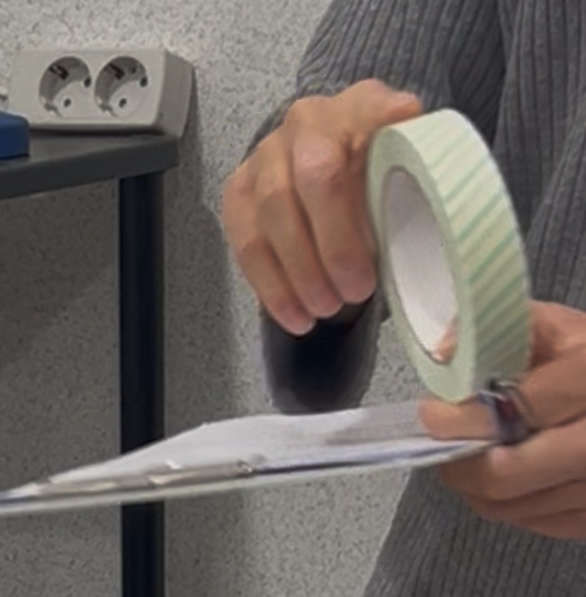 | 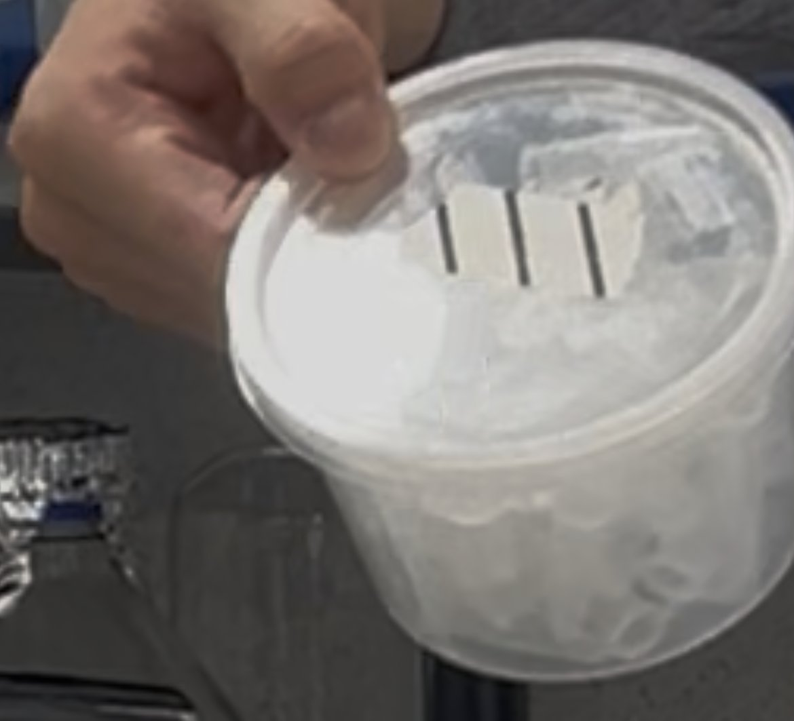 |

📷 캡처 필요 #16 — ✅ 위 사진

## 5. 결과

| 장비 | 한 일 | 관찰·측정값 | 근거 |
|---|---|---|---|
| 현미경 | 나노 패턴 필름, dECM 패턴, 식물 조직 사진 관찰 | ×10 배율로 관찰. 나노 패턴은 광학 현미경으로 잘 보이지 않음 | 녹음·사진 |
| 인장 시험기 | 시료를 그립에 물리고 0으로 맞춘 뒤 100 mm/min으로 인장 시험 (1회) | 최대 하중 41.046 N, 응력 14.926 MPa, 변형률 36.158 %, 파단점 응력 12.337 MPa. 실패한 시험은 최대 하중 0.0166 N | 녹음·사진 |
| 스핀 코터 | 패치 위 코팅 시연 | 3,500 rpm | 녹음·사진 |
| UV 경화 챔버 | 나노 패턴 필름을 꺼내 보여줌 | 필름이 각도에 따라 무지개색으로 반짝임 | 녹음·사진 |
| 클린벤치 | 구조·용도 설명 | BSC Class II Type A2 확인 | 녹음·사진 |
| 오토클레이브 | 멸균 시연 | 설정 121.2 °C, 멸균 테이프 연두색 → 검은색 | 녹음·사진 |

## 6. 고찰 (보고서용 아이디어)

- **같은 조건에서 반복해야 믿을 수 있다.** 인장 시험의 0.0에서 시작하기(Clear extension·Force ReZERO)·이전 시료 파편 제거·그립 중심 맞추기·5~10회 반복, 그리고 시료가 제대로 물리지 않아 하중이 0.0166 N에 그친 실패 사례, 스핀 코터의 최적 RPM 고정은 2회차의 "기준 맞추기"와 같은 원리다.
- **보이는 크기의 한계.** 나노 패턴이 광학 현미경으로 보이지 않는 이유와, 그런데도 필름이 빛에 반짝이는 이유(패턴이 빛과 상호작용)
- **구조가 세포를 이끈다.** 정렬된 나노 패턴 위에서 세포가 잘 자란다는 설명 → 만들기(UV 경화·스핀 코팅)와 확인(현미경·인장 시험)이 세포 지지체 연구로 이어진다.
- **데이터를 쌓아 비교한다.** 인장 시험 결과는 데이터베이스에 날짜·시료·속도와 함께 저장되어, 과거 시험과 비교하거나 CSV로 내보내 평균을 낼 수 있다.
- **무균의 의미.** 오토클레이브(멸균)와 클린벤치(무균 유지)는 역할이 다르다.

## 7. 확인 필요 목록

- [x] 실습 날짜 2026-10-01, 마감 2026-10-08
- [x] 장비 모델명 → ZEISS Axio Vert.A1 / A&D MCT-1150 (MSAT-Lite) / ACE-200 / UV-A Curing Chamber / BSC Class II Type A2 / DAIHAN 오토클레이브 (사진)
- [ ] 교수님이 말한 "클린벤치"가 BSC인지 다른 작업대인지
- [ ] 현미경 카메라 프로그램 이름 ("아이캠"?)
- [ ] 나노 패턴 필름 제작 공정 ("폴리탄 Q 성질", "릴링"), 필름 표시 "N 600/800"의 뜻
- [ ] dECM이 맞는지, 탈세포화 방법
- [ ] 파티클 크기 단위 (100 µm?)
- [ ] "키스/기 테스트"가 무엇인지
- [x] 시험 속도 → 100 mm/min (화면)
- [ ] 인장 시험 시료가 PDMS인지, 입력 치수(50 × 0.055 × 50 mm)가 실제 값인지, 기준 길이 10 mm의 정체, 패널 숫자의 단위
- [ ] 데이터 검색 프로그램의 정확한 이름 ("DBSearchLite"?)
- [ ] 스핀 코팅 시간 (주인 확인: 영상으로 확인 못 함), 콜라겐 외 코팅 물질
- [ ] UV 경화 시간 (주인 확인: 영상으로 확인 못 함)
- [x] 테이프 처리 전 색 → 연두색 사선 (사진)
- [ ] 오토클레이브 멸균 시간

## 참고 자료

(원리 심화를 쓸 때 원문을 확인한 출처만 추가한다)
